# /changes

Generate a human-readable explanation of implemented changes. The purpose is communication, not documentation. The audience includes developers, reviewers, managers, and stakeholders.

The skill is a tool for the developer, not a replacement. The developer stays at the centre - every decision about what to document, which trade-offs to highlight, and which risks to accept is driven by the developer's judgement. The skill surfaces information, but the developer decides what matters.

## Pre-condition Check

Before any questions, verify that a specification exists for this feature:

1. Determine the target folder (ask if not known or inheritable from context).
2. Check if `spec.md` exists in that folder.
3. If `spec.md` does not exist, refuse to proceed: "A changes document documents what changed relative to a specification. Without a spec, there is no anchor to compare against. Please run /sdd first to create a specification for this feature."
4. If `spec.md` exists but is incomplete, warn and ask whether to proceed or complete the spec first.
5. If `spec.md` is complete but lacks documented hidden assumptions, flag this and ask the user to review.

> [!IMPORTANT]
> This check is non-negotiable. The changes skill cannot produce meaningful output without a spec.

## Implementation Validation

Before generating the changes document:

1. Read the `spec.md` to extract requirements, acceptance criteria, decisions, and constraints.
2. Inspect the actual implementation (code changes, file modifications, architecture) and verify each maps back to a corresponding item in the spec.
3. If requirements from the spec are not addressed, flag them as **unimplemented** and ask if intentionally dropped.
4. If the implementation includes behaviour not covered by the spec, flag it as **untracked** and ask for justification.
5. If `AGENTS.md` exists, validate that the implementation respects its constraints, best practices, and architectural directives. Flag deviations.

## Vulnerability Scanning

Before generating the changes document, perform vulnerability scanning on the implemented code:

1. Scan for: dependency issues, insecure code patterns, hardcoded secrets, injection vectors, missing validation, exposed credentials, misconfigurations.
2. For each finding, study the issue and determine the fix approach.
3. Present findings to the user and propose fixes. Fix iteratively until resolved or risk is accepted.
4. Document all findings, fixes, and accepted risks in the changes document.
5. If `AGENTS.md` defines a vulnerability scanning policy, follow it. Otherwise, use reasonable defaults.

> [!NOTE]
> Vulnerability scanning is a lightweight iterative check that catches obvious issues before they reach review.

## Ordered Questions

Ask the following questions in this exact order, one at a time:

1. **Context inheritance**: Do you want to inherit context from the past 5 specifications and repository structure?
2. **Output location**: In which folder should the changes document be saved? Default is the same folder as the originating spec.

## Agent Behaviour: Do and Do Not

**Do:**
- Compare the implementation against the specification. Flag unimplemented requirements and untracked behaviour.
- Document hidden assumptions discovered during implementation.
- Challenge the user if implementation drifts from spec without justification.
- Surface trade-offs accepted during implementation and alternatives.
- Self-critique and self-review your own draft before presenting it.
- Only include Mermaid diagrams in the Workflow Diagram section when they improve understanding.
- Use pastel color palette for Mermaid diagrams.
- Wrap every Mermaid diagram inside a subgraph block for dark mode.

**Do Not:**
- Say "everything looks good" without verifying each requirement and acceptance criterion.
- Skip the pre-condition check.
- Document changes without mapping them back to the specification.
- Add Mermaid diagrams as decoration.
- Accept discrepancies without flagging them.
- Generate output without first validating all required sections.

## Output

Generate a file named `changes.md`. The document explains:
- **why** the change was introduced
- **what** changed
- **how** each change maps back to the spec's requirements, decisions, and acceptance criteria
- **how** behaviour evolved (before vs after)
- **which tests** were executed and results
- **which trade-offs** were accepted
- **which decisions and hidden assumptions** were made during implementation
- **which vulnerabilities** were found, studied, and fixed

## Structure

The generated document must contain:

### Why
Motivation behind the change.

### Overview
High-level explanation of what was done, avoiding technical details.

### Runtime Impact Summary
How the change affects users, operators, or business processes - in plain language.

### Changes
Technical deep dive covering end-to-end modifications. List files inside a collapsed `<details>` block with clickable links relative to `changes.md`.

```markdown
<details>
<summary>Modified files (N)</summary>

- [`../relative/path/to/file.js`](../relative/path/to/file.js) - brief note

</details>
```

Include: how architecture changed, APIs modified, database migrations, decisions made during implementation, hidden assumptions discovered.

### Tests
Validation performed, test results, coverage information.

### Vulnerability Scan
Findings, fixes, accepted risks, and lessons learned.

### Workflow Diagram
High-level Mermaid diagram showing the overall flow (only if it improves understanding).

### Summary
Narrative recap tying all sections together.

Use GitHub alert tags (`> [!IMPORTANT]`, `> [!WARNING]`, `> [!CAUTION]`, `> [!TIP]`, `> [!NOTE]`) for critical points.

## Validation

Validate that the generated `changes.md` contains all required sections. If any section is missing, warn the user and request confirmation.

If the document contains a Mermaid diagram in the Workflow Diagram section, validate that it follows the required style:
- Init config line: `%%{init: { "theme": "base", "look": "handDrawn", "layout": "dagre" }}%%`
- Wrapped in `subgraph bg[" "]` with `direction TB`
- Nodes annotated with `:::className` (using classDef for start, process, decision, endclass)
If the diagram does not conform, fix it before output.

## Output Location

The generated file must always be stored next to the specification that originated the work. The relationship between spec and changes is fixed.

## Workflow

```mermaid
%%{init: { "theme": "base", "look": "handDrawn", "layout": "dagre" }}%%
flowchart TD
    subgraph bg[" "]
    direction TB
    classDef start fill:#CEEAD6,color:#1a3a15,stroke:#8fbf9a,stroke-width:2px
    classDef process fill:#D2E3FC,color:#0f2440,stroke:#8fb0e0,stroke-width:2px
    classDef decision fill:#FEEFC3,color:#4d2e0f,stroke:#d4c48a,stroke-width:2px
    classDef endclass fill:#FAD2CF,color:#3a1a1a,stroke:#d4a8a3,stroke-width:2px

    A[Start /changes]:::start --> B{spec.md exists?}:::decision
    B -->|No| C[Refuse to proceed - a spec is required]:::process
    C --> D[End]:::endclass
    B -->|Yes| E{spec.md is complete?}:::decision
    E -->|No| F[Warn user, ask to complete spec or proceed]:::decision
    E -->|Yes| G[Ask 2 ordered questions]:::process
    F -->|Proceed anyway| G
    F -->|Complete spec first| H[Exit to /sdd]:::endclass
    G --> G1[1. Inherit context from past 5 specs?]:::process
    G1 --> G2[2. Output folder? default: same as spec]:::process
    G2 --> I[Read spec.md, extract requirements and decisions]:::process
    I --> J[Inspect actual implementation changes]:::process
    J --> K{All spec requirements addressed?}:::decision
    K -->|No| L[Flag unimplemented requirements]:::process
    K -->|Yes| M{Untracked behaviour found?}:::decision
    L --> M
    M -->|Yes| N[Flag untracked behaviour]:::process
    M -->|No| O{Vulnerability scan}:::decision
    N --> O
    O --> P[Scan code for vulnerabilities]:::process
    P --> Q{Vulnerabilities found?}:::decision
    Q -->|Yes| R[Study each finding, propose fixes iteratively]:::process
    Q -->|No| S[Document security posture]:::process
    R --> S
    S --> T[Generate changes.md with all sections]:::process
    T --> U[Validate all sections present]:::process
    U -->|Pass| V[Output changes.md to spec folder]:::process
    U -->|Fail| W[Warn user, confirm omissions]:::process
    W --> V
    V --> X[End /changes]:::endclass
    end
```



### Branch and Case Descriptions

- **spec.md missing**: refuses to proceed.
- **spec.md incomplete**: warns and offers to complete spec or proceed anyway.
- **Context inheritance**: inspects past 5 specs and repo structure if enabled.
- **Unimplemented requirements**: spec items not found in implementation are flagged.
- **Untracked behaviour**: implementation changes not covered by spec are flagged.
- **Vulnerability scan**: scans code; if issues found, fixes iteratively until resolved or risk accepted.
- **Output validation**: checks all required sections; warnings on omissions with override.
