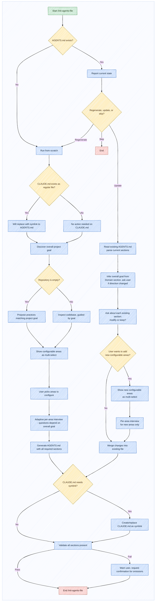

# /init-agents-file

Generate and maintain a project-specific `AGENTS.md` file that reflects the actual architecture, constraints and conventions of the project. The generated file must be project-specific, not a generic template.

## Pre-condition Check

Before proceeding, the skill must check whether an `AGENTS.md` already exists in the repository root:
- If `AGENTS.md` already exists, report its current state (file size, last modified date) and ask the user whether they want to **regenerate from scratch**, **update specific areas**, or **skip**.
- **Skip** exits immediately.
- **Regenerate from scratch** discards the existing file and runs the full generation flow.
- **Update specific areas** enters Update Mode where the skill reads the existing file and merges changes.
- If `CLAUDE.md` exists as a regular file (not a symlink), replace it with a symlink pointing to `AGENTS.md`.

## Behaviour

The skill is a tool for the developer, not a replacement. The developer stays at the centre - every question, every decision, every section of `AGENTS.md` is driven by the developer's answers and intent. The skill does not make assumptions about what the developer wants; it asks.

The core mechanism is a conversational question-and-answer process. The skill asks the user a sequence of questions, one at a time, to progressively define the content of `AGENTS.md`. Each answer directly shapes what gets written into the file. Throughout this process, surface hidden assumptions as a mandatory concern - document implicit knowledge that the user may not have explicitly stated.

### If the repository is empty:
Propose best practices matching the project goal. The interaction should feel like a conversation with an experienced engineer, not like filling out a form.

### If the repository already exists:
Inspect the codebase and infer as much context as possible before generating recommendations. This includes:
- **repository structure** - how the code is organized
- **technology stack** - languages, frameworks, libraries, build tools

Then explicitly ask about aspects that cannot be auto-inferred:
- **coding conventions** - naming, formatting, organization
- **testing approaches** - framework, location, naming, coverage
- **architectural patterns** - layered, hexagonal, feature-based
- **engineering practices** - code review, CI/CD, deployment, monitoring
- **operational domain** - business/technical domain, regulations, terminology

Questions must be asked one at a time. Use answers to determine which questions to ask next.

### Update Mode

When the user chooses **update specific areas**:
1. Read the existing file, parse current sections
2. Infer the overall goal from the Domain section; ask if direction has changed
3. Ask about each existing section: modify or keep?
4. Probe for new needs: "Is there anything else your team needs that isn't documented yet?"
5. For new areas, reuse the configurable areas multi-select and per-area interview
6. Merge changes into the existing content
7. Validate all required sections are present

### Overall Goal Discovery

Ask the user what the project is about. Based on the answer, infer which configurable areas are relevant. Document the goal in the Domain section.

### Configurable Areas

Present as a **multiple selection** interface. The user picks which areas to configure:

- security, safety, maintainability, readability, simplicity, testing, architecture, modularity, scalability, OOP principles, GoF patterns, coding style, code documentation, technology stack, operational domain, repository-specific constraints, extras

Only selected areas are discussed. Per-area questions adapt based on the overall goal.

### Mandatory Principle

Every generated `AGENTS.md` must encourage inspection of existing implementations before introducing new ones. This is not optional.

The objective is avoiding unnecessary duplication while also avoiding premature abstractions. The balance is subtle: reuse existing code when appropriate, but do not create generic abstractions before there is evidence that they are needed. Before writing new code, the agent and the developer should look at what already exists. If something similar already exists, reuse it. If not, consider whether a general solution is justified or a specific solution is more appropriate.

## Structure

The generated document must contain:

### Domain
Operational domain, terminology, regulations, and constraints that agents must be aware of.

### Repository Structure
How the codebase is organized and where different types of code live.

### Architectural Directives
Architectural rules, patterns, and constraints that agents must follow.

### Engineering Best Practices
Coding standards, testing requirements, and quality expectations.

### Workflow Checklist
The steps that agents should follow when implementing changes, including a **branch creation step** (ask the user if they want to create a new branch before implementation), a self-evaluation step, and a vulnerability scanning step.

Use GitHub alert tags (`> [!IMPORTANT]`, `> [!WARNING]`, `> [!TIP]`, `> [!NOTE]`) for scannability.

### Skill References

The skill includes a `references/` directory at `skills/init-agents-file/references/` containing pre-loaded documentation. When the user selects the **code documentation** configurable area, load `references/commenting-philosophy.md` instead of fetching it from the web. This file presents a practical philosophy of code comments, covering why comments matter, common categories (intent, boundary, summary, reference, teacher), and which types to avoid.

### Claude Compatibility

Ensure `CLAUDE.md` is a symlink to `AGENTS.md`. If it exists as a regular file, replace it.

### Validation

Validate that the generated `AGENTS.md` contains all required sections. If any section is missing, warn the user and request confirmation.

### Workflow

### Branch and Case Descriptions

- **AGENTS.md exists**: reports state and offers regenerate/update/skip. Skip exits immediately.
- **AGENTS.md missing**: proceeds directly to generation flow.
- **Regenerate from scratch**: discards existing file and runs full generation flow.
- **Update mode**: reads existing file, infers goal from Domain section, asks one question at a time about modifications. New areas shown as multi-select.
- **CLAUDE.md exists as file (not symlink)**: flags for symlink replacement.
- **Repository empty**: proposes best practices without codebase inspection.
- **Repository non-empty**: inspects codebase for context.
- **Configurable areas**: displayed as multi-select.
- **Adaptive per-area interview**: questions branch based on overall goal.
- **Post-generation**: validates all required sections present.
