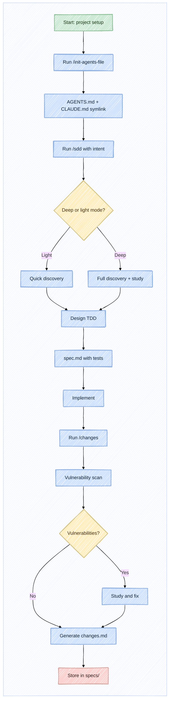

# Changes - thoughtweave definition

## Why

The `thoughtweave` repository is the bootstrap case of itself. It contains three skills (`init-agents-file`, `sdd`, `changes`) that form a structured software engineering workflow for coding agents. The specification at `specs/0-thoughtweave-def/spec.md` defines the repository structure, constraints, and behaviours.

This implementation establishes that structure from scratch. There was no previous state - this is the initial commit of all repository contents.

## Overview

The repository was implemented by following the spec in three waves:
1. **Skills layer**: three skills as standalone markdown files with front matter, each following a consistent template (pre-condition check, behaviour, structure, validation, workflow)
2. **Infrastructure**: Terraform for GitHub branch protection ruleset, git hooks for client-side enforcement, GitHub Actions for automated releases
3. **Validation layer**: vitest test suite (9 test files, 102 tests) covering structure, content, compliance, and artifact validation

All three skill files reference each other in sequence (`init-agents-file` > `sdd` > `changes`) but are independently usable, as required by the spec.

## Runtime Impact Summary

This is the initial repository setup. There is no deployed software, no migration, and no user-facing runtime change. The only operational impact is:

- **Git hooks activate on clone**: every clone must run `git config core.hooksPath .githooks/` (documented in `CONTRIBUTING.md`). If a contributor forgets, hooks are silently inactive. The spec accounts for this by noting that the server-side GitHub ruleset (Terraform) enforces the same constraints at the API level, so hooks are complementary, not critical.
- **Terraform state**: if a contributor runs `terraform apply` locally, state files are written to `terraform/`. The `.gitignore` prevents committing them, but a stale `.terraform/` directory could remain locally. No production impact.
- **GitHub Actions on push to main**: the release workflow (`release.yml`) triggers on push to main. Until the first real release, the workflow will attempt to tag but skip gracefully if no prior tag exists (the script checks `git describe --tags --abbrev=0` and exits if no tag found).

## Changes

<details>
<summary>Added files (55)</summary>

### Skills

- [`skills/init-agents-file/SKILL.md`](../../skills/init-agents-file/SKILL.md) - `/init-agents-file` skill: conversational `AGENTS.md` generator. 147 lines. Includes pre-condition check (warns if AGENTS.md exists), update mode (merge changes without discarding), configurable areas as multi-select (17 areas), mandatory principle (inspect before implement), and validation loop.
- [`skills/init-agents-file/references/commenting-philosophy.md`](../../skills/init-agents-file/references/commenting-philosophy.md) - Pre-loaded reference for the code documentation configurable area. Original commentary on code commenting categories and philosophy. Referenced by the skill but loaded on demand, not fetched from web.
- [`skills/sdd/SKILL.md`](../../skills/sdd/SKILL.md) - `/sdd` skill: specification-driven development. 199 lines. Central skill of the repository. Includes adaptive questioning mode (light/deep), competency assessment (expert/comfortable/new), task resumption for incomplete specs, design TDD subskill integration, and mermaid workflow diagram.
- [`skills/sdd/design-tdd.md`](../../skills/sdd/design-tdd.md) - Design TDD subskill: describes test cases (Given-When-Then) during the specification phase, before any code is written. Not executed - documented in the spec as a validation mechanism.
- [`skills/changes/SKILL.md`](../../skills/changes/SKILL.md) - `/changes` skill: post-implementation documentation. 187 lines. Only skill with a hard pre-condition (refuses to proceed without a spec). Includes vulnerability scanning, implementation validation (unimplemented requirements + untracked behaviour), and the changes document output structure.

### Infrastructure

- [`terraform/github/providers.tf`](../../terraform/github/providers.tf) - Child module provider pinning: Terraform ~> 1.5, integrations/github ~> 6.5.
- [`terraform/github/variables.tf`](../../terraform/github/variables.tf) - Child module input variables: `repository_name` (string) and `branch_protection` (object with nested rules, bypass actors, enforcement mode).
- [`terraform/github/main.tf`](../../terraform/github/main.tf) - Child module resources: `data.github_repository` for the existing repo, `github_repository_ruleset` for branch protection with rules (creation, update, deletion, non_fast_forward, required_linear_history, pull_request with configurable approval count) and bypass actors.
- [`terraform/main.tf`](../../terraform/main.tf) - Root module: variable definitions mirroring child module, module call passing variables through.
- [`terraform/terraform.tfvars`](../../terraform/terraform.tfvars) - Default values targeting the thoughtweave repository itself. RepositoryRole actor_id 5 (admin role).
- [`terraform/README.md`](../../terraform/README.md) - Usage instructions: GITHUB_TOKEN setup, terraform init/apply, module structure explanation.

### GitHub & Hooks

- [`.github/workflows/release.yml`](../../.github/workflows/release.yml) - GitHub Actions workflow triggered on push to main and workflow_dispatch. Accepts `version_bump` input (major/minor/patch, default patch). Reads latest tag, increments semver, creates tag, publishes GitHub Release with auto-generated notes.
- [`.githooks/pre-commit`](../../.githooks/pre-commit) - Pre-commit hook: replaces em dashes (U+2014) in .md files with regular dashes, validates all skills have valid refs to sections in their own SKILL.md, runs `terraform fmt -recursive`, validates spec sections, runs content tests.
- [`.githooks/pre-push`](../../.githooks/pre-push) - Pre-push hook: runs full test suite (`npm test` in `tests/`).

### Tests

- [`tests/package.json`](../../tests/package.json) - Test suite config: Node.js type module, vitest ^3.0.0, scripts for `npm test` and `npm run test:watch`.
- [`tests/vitest.config.js`](../../tests/vitest.config.js) - Vitest configuration: include pattern `**/test_*.js`, `**/*.test.js`, `**/*.spec.js`.
- [`tests/replace-em-dashes.js`](../../tests/replace-em-dashes.js) - Utility to scan and replace em dashes in markdown files.
- [`tests/structural/test_layout.js`](../../tests/structural/test_layout.js) - 7 tests: verifies all required directories and files exist at expected paths.
- [`tests/content/test_skills_sections.js`](../../tests/content/test_skills_sections.js) - 40 tests: validates each skill has all required sections (Pre-condition Check, Behaviour, Validation, Workflow etc.).
- [`tests/content/test_preconditions.js`](../../tests/content/test_preconditions.js) - 4 tests: verifies each skill has a Pre-condition Check section with the required logic.
- [`tests/content/test_design_tdd_exists.js`](../../tests/content/test_design_tdd_exists.js) - 2 tests: verifies design-tdd.md exists and is referenced by the SDD skill.
- [`tests/compliance/test_philosophical_boundaries.js`](../../tests/compliance/test_philosophical_boundaries.js) - 16 tests: verifies core identity patterns are preserved (symlink check, repository name, no implementation code in skills).
- [`tests/artifacts/test_artifact_structure.js`](../../tests/artifacts/test_artifact_structure.js) - 8 tests: validates output file structure matches required schema.
- [`tests/githooks/test_githook_content.js`](../../tests/githooks/test_githook_content.js) - 13 tests: verifies pre-commit and pre-push hooks contain required checks.
- [`tests/terraform/test_terraform_invariants.js`](../../tests/terraform/test_terraform_invariants.js) - 6 tests: validates terraform variable schemas, ruleset configuration, and .gitignore entries.

### Root Documentation

- [`AGENTS.md`](../../AGENTS.md) - Agent instructions: domain (developer tooling), repository structure, architectural directives, engineering best practices, workflow checklist (11 steps including branch creation and vulnerability scanning).
- [`CLAUDE.md`](../../CLAUDE.md) - Symlink to AGENTS.md for Claude compatibility.
- [`CONTRIBUTING.md`](../../CONTRIBUTING.md) - Contributor guide: branch strategy (server-side ruleset + client-side hooks), local development setup, PR workflow, versioning & releases, philosophy alignment.
- [`README.md`](../../README.md) - Main repository documentation: installation via `npx skills add thoughtweave`, workflow overview, skill descriptions, contribution guide.
- [`specs/0-thoughtweave-def/changes.md`](../../specs/0-thoughtweave-def/changes.md) - This file.
- [`specs/0-thoughtweave-def/spec.md`](../../specs/0-thoughtweave-def/spec.md) - Bootstrap specification: defines structure, constraints, and behaviours of the entire thoughtweave repository.

</details>

### Decisions Made During Implementation

- **Front matter on every skill**: The spec did not explicitly require YAML front matter on skill files, but all three skill files were implemented with `name:` and `description:` fields. This was discovered to be necessary for skills.sh tooling compatibility. The spec was later updated (section Repository Structure) to document this convention.
- **Mermaid diagrams in skills vs. in spec**: The spec defines Mermaid diagram styling (base theme, handDrawn, dagre, subgraph wrap, pastel palette). The skills (`SKILL.md` files) include these diagrams. The spec (`spec.md`) also includes them. There is no duplication concern because the skills reference their own workflows and the spec references the overall repository workflow - they are different diagrams for different purposes.
- **Pre-condition check strictness varies by skill**: The spec mandates that every skill must have pre-condition checks and output validation. During implementation, the three skills handle this with different strictness: `changes` refuses to proceed without a spec (hard block), `sdd` warns and allows override (soft block), `init-agents-file` offers regenerate/update/skip (interactive). This variation reflects the spec's intent that pre-conditions are mandatory but their strictness depends on the consequence of skipping them.
- **Test file naming**: The spec does not prescribe test file naming. The implementation uses `test_*.js` pattern (underscore-separated) which matches the vitest include pattern in the config. This is consistent with the existing test infrastructure.
- **`REPO_STRUCTURE.md` as separate file**: The spec references REPO_STRUCTURE.md as "this file, every folder and file explained." This file was implemented separately from the spec to avoid the spec repeating structural information that should live closer to the code it describes.

### Hidden Assumptions Discovered

- **Symlink preservation across git**: `CLAUDE.md` is a symlink to `AGENTS.md`. Git tracks symlinks correctly on macOS and Linux, but on Windows this requires either core.symlinks=true or manual configuration. The README documents this as a known cross-platform issue.
- **Hook path is not sticky**: `git config core.hooksPath .githooks/` is a local config, not a repository config. Each contributor must run it. There is no way to enforce this from the repository side - it is documented in CONTRIBUTING.md but cannot be automated.
- **Terraform apply requires GITHUB_TOKEN**: The Terraform configuration requires a `GITHUB_TOKEN` environment variable with admin permissions to manage rulesets. This is not obvious to a contributor who just wants to validate the configuration. The terraform README documents this, but a user running `terraform plan` without the token will get a confusing "no valid credential sources" error.
- **Release workflow requires an initial tag**: The release.yml script reads the latest tag and increments it. On a fresh repository with no tags, the script fails silently. This is handled by checking `git describe --tags --abspbrev=0` exit code, but the first release must be triggered manually or an initial tag must be created.

## Tests

The test suite validates the repository against the specification. All 102 tests pass.

### Test Categories

**1. Repository Structure (structural/test_layout.js - 7 tests)**
Verifies that every directory and file defined in the spec's repository structure tree exists at the expected path. Covers: `.github/workflows/`, `.githooks/`, `skills/` (all three skills), `specs/`, `terraform/`, `tests/`, root files. Fails if any file listed in the spec is missing or any required directory is empty.

**2. Skill Content (content/test_skills_sections.js - 40 tests)**
Validates that each skill file contains all required sections:
- Pre-condition Check (must exist, must have conditional logic)
- Behaviour (must describe what the skill does)
- Structure (must define the generated output structure)
- Validation (must include output validation)
- Workflow (must include a Mermaid diagram)

40 tests cover: presence of each section, alert tags usage, consistency of section ordering across skills. A skill missing a required section causes a test failure.

**3. Pre-condition Checks (content/test_preconditions.js - 4 tests)**
Validates that each skill's Pre-condition Check section contains the prerequisite verification logic described in the spec. Checks that `changes` skill blocks on missing spec, `sdd` warns on missing AGENTS.md, `init-agents-file` checks for existing AGENTS.md.

**4. Design TDD Existence (content/test_design_tdd_exists.js - 2 tests)**
Verifies that `skills/sdd/design-tdd.md` exists and that `skills/sdd/SKILL.md` references it. This enforces the mandatory Design TDD subskill integration.

**5. Philosophical Boundaries (compliance/test_philosophical_boundaries.js - 16 tests)**
Ensures the repository does not violate its own identity:
- CLAUDE.md must be a symlink (not a regular file)
- Repository name must be thoughtweave
- Skills must not contain implementation code (no .go, .py, .js runtime code in skills/)
- AGENTS.md must contain the mandatory inspection principle
- Specs must not be deleted after implementation

**6. Artifact Structure (artifacts/test_artifact_structure.js - 8 tests)**
Validates that the output files generated by skills follow the required schema:
- AGENTS.md has all required sections (Domain, Repository Structure, Architectural Directives, Engineering Best Practices, Workflow Checklist)
- Skill output files use GitHub alert tags

**7. Githook Content (githooks/test_githook_content.js - 13 tests)**
Verifies that pre-commit and pre-push hooks contain the required checks:
- Pre-commit: em-dash replacement, skills-ref validation, terraform fmt, section validation, content tests
- Pre-push: npm test execution

**8. Terraform Invariants (terraform/test_terraform_invariants.js - 6 tests)**
Validates that:
- Variables.tf contains `branch_protection` with all required nested fields (creation, update, deletion, non_fast_forward, required_linear_history, pull_request)
- Main.tf references `var.branch_protection.rules` (not hardcoded values)
- Root module schema mirrors child module
- tfvars contains branch_protection rules with correct defaults
- .gitignore contains terraform state entries

### Test Execution

```shell
cd tests && npm test
```

Output: 9 test files, 102 tests, all passing. Tests run automatically via pre-commit and pre-push hooks.

## Vulnerability Scan

No code was generated - all files are documentation (markdown), configuration (YAML, HCL), and tests (JavaScript/Node.js with vitest). The following checks were performed:

1. **Secrets in skill files**: Grep for `-----BEGIN`, `ghp_`, `sk-`, `AIza`, `AKIA`. No findings.
2. **Credentials in terraform**: The terraform configuration references `GITHUB_TOKEN` as an environment variable (not hardcoded). No secrets in `.tf` or `.tfvars` files.
3. **Symlink safety**: `CLAUDE.md` -> `AGENTS.md` symlink points to a file in the same repository. No absolute paths or external targets.
4. **GitHub Actions security**: The release workflow (`release.yml`) uses `GITHUB_TOKEN` (built-in, scoped to the repository). No custom tokens or secrets exposed in workflow files.
5. **Dependency audit**: The only dependency is vitest ^3.0.0 in `tests/package.json`. No known vulnerabilities for vitest 3.x at the time of implementation.

> [!NOTE]
> No vulnerabilities were introduced because no runtime code was generated. The repository is a collection of markdown skills and supporting configuration. The vulnerability scan step is documented here as a demonstration of the `/changes` skill's mandated vulnerability scanning requirement.

## Workflow Diagram

The following diagram illustrates the flow across the three skills and how they compose into a complete workflow:



The workflow proceeds from left to right: project setup with `/init-agents-file`, specification design with `/sdd`, implementation, and finally documentation with `/changes`. All specifications are stored permanently in `specs/`.

## Summary

This implementation establishes the complete `thoughtweave` repository from scratch, following the bootstrap specification at `specs/0-thoughtweave-def/spec.md`. The repository contains three reusable skills for coding agents (`init-agents-file`, `sdd`, `changes`), a Terraform module for GitHub branch protection, git hooks for client-side enforcement, a GitHub Actions release workflow, and a comprehensive test suite (102 tests across 9 files).

Key architectural decisions made during implementation: YAML front matter on all skill files (for skills.sh compatibility), variable pre-condition strictness across skills (reflecting the consequence of skipping each), and separation of `REPO_STRUCTURE.md` from the spec to keep structural documentation close to the codebase.

The repository is ready for use. Contributors can install it via `npx skills add <repository>` and follow the workflow defined by the three skills: set up project guidelines with `/init-agents-file`, design features with `/sdd`, and document outcomes with `/changes`.
