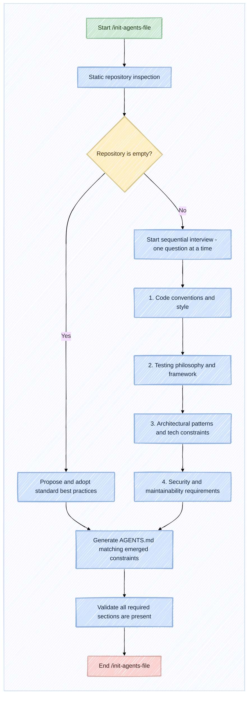
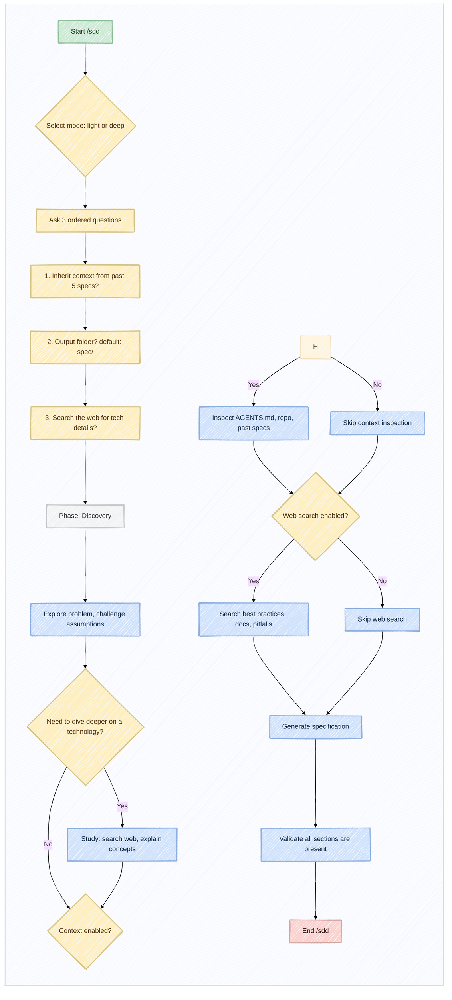
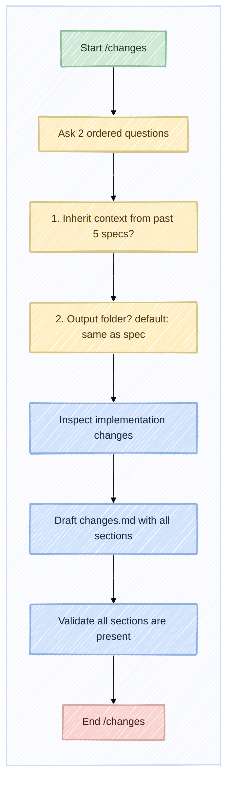

# **`thoughtweave`: Repository Specification**

## Meaning

`thoughtweave` is a development workflow that puts understanding before generation. The name combines two concepts that must work together:

- **Thought** - the cognitive work: intent discovery, reasoning, decision-making, surfacing hidden assumptions. The engineering thinking that happens before any code is written.
- **Weave** - the structured process of turning that thinking into a specification, then into implementation, then into documentation. Intent and spec are woven together, not sequenced.

The name is not an acronym. It is a deliberate description of what the workflow does: it weaves thought into software through a guided, iterative process with a coding agent as a thinking partner.

The objective is not generating code faster. Speed is a welcome side effect, not the goal.

The objective is helping developers understand problems better before implementation begins. When you understand what you are building, the code writes itself more naturally. When you do not understand, you fight prompts, regenerate outputs, and accumulate technical debt disguised as iteration.

Coding agents should guide developers through a workflow that starts from intent, evolves into a specification, leads to implementation and ends with clear communication of the resulting changes. The agent is not a code generator. It is a thinking partner.

The workflow can be summarized as:

- **Intent** - understanding the problem, the desired outcome, the constraints and the trade-offs before writing anything.
- **Specification** - documenting decisions, requirements, test strategy and acceptance criteria so that implementation has a clear target.
- **Implementation** - transforming the specification into working software, knowing exactly what success looks like.
- **Explanation** - communicating what changed, why it changed and how the behaviour evolved, so that reviewers, stakeholders and future contributors can understand the outcome without reverse-engineering the code.

> [!IMPORTANT]
> Intent comes first. Without intent, every subsequent step is guessing.

Specifications document decisions. They are not bureaucratic artifacts. They are engineering memory.

Implementation transforms decisions into software. It is the execution of a plan, not the discovery of one.

Documentation explains outcomes. It closes the loop and makes the work understandable to others.

## Objective

Create a GitHub repository compatible with skills.sh containing a set of reusable skills that help software engineers work with coding agents in a more deliberate and structured way.

The repository should be installable through:

```shell
npx skills add <repository>
```

Versioned installations shall be supported through git tags for master branches and commit hashes for other branches, so that teams can pin their workflow to a specific version and upgrade intentionally rather than accidentally.

The purpose of this project is not creating another AI framework. There are already plenty of those, and most of them solve problems that the average developer does not have.

The purpose is codifying a workflow that has consistently helped me obtain better results from coding agents in day-to-day software engineering work. This is a collection of lessons learned from real projects, not theoretical best practices.

This workflow prioritizes understanding over implementation speed. The assumption is that taking time to understand before building reduces the total time spent from idea to shipped feature, because fewer iterations are wasted on misunderstandings.

Developers should spend less time fighting prompts and regenerating code and more time understanding requirements, constraints, trade-offs and desired outcomes. A prompt that clearly expresses intent produces better results on the first attempt than ten prompts that iterate blindly.

Code generation is a tool. It is not the objective. It is not the craft. It is a means to an end.

Understanding is the objective. The code is just a side effect of understanding what needs to be built.

> [!IMPORTANT]
> Every skill in this repository must include two layers of built-in validation:
>
> 1. **Pre-condition checks** - before executing, each skill must verify that its prerequisites are met (as defined in each skill's [Pre-condition Check](#pre-condition-compliance-tests) section). If prerequisites are missing, the skill must either refuse to proceed or warn the user and document the omission.
> 2. **Output validation** - after generating its output file, the skill must verify that the file contains all required sections as defined by this specification. If a required section is missing, the skill must notify the user and request confirmation before proceeding. This ensures that the output is always complete and that omissions are intentional rather than accidental.
>
> Both layers are mandatory. A skill that skips either validation is non-compliant with this specification.

## Core Philosophy

> [!IMPORTANT]
> Before building anything, understand why it should exist.
>
> This sentence is not a decoration. It is the single most important rule in this repository. Every workflow, every skill, every generated document exists to serve this principle.

> [!WARNING]
> Most software problems are not implementation problems. When you look at a failing project, a delayed feature or a buggy release, the root cause is rarely "we could not write the code." The root cause is almost always "we did not understand the problem well enough."
>
> They are understanding problems.

Requirements are often unclear. Stakeholders say one thing and mean another. Documents are incomplete. Specifications are written after implementation rather than before.

Constraints are often implicit. Performance requirements, security boundaries, integration limitations - these are discovered during implementation rather than defined beforehand.

> [!WARNING]
> Assumptions are rarely challenged. Teams assume they understand what the user needs. They assume the architecture is correct. They assume the framework will handle edge cases. And then they are surprised when reality does not match their assumptions.

Coding agents can generate code remarkably well. The current generation of AI tools can produce working code for a surprisingly wide range of tasks. But that is not the hard part of software engineering.

Software engineering is not the act of generating code. Currently, generating code is the easiest part of the job. The hard parts are understanding the problem, designing the solution, evaluating trade-offs, ensuring maintainability and communicating decisions to other humans.

Software engineering is the process of understanding problems and transforming them into maintainable solutions. Code generation is just one step in that process, and arguably not the most important one.

This repository exists to help developers use coding agents as engineering tools rather than treating them as magic boxes. A coding agent is not a replacement for thinking. It is a tool that helps you think faster and more clearly, provided you know what you want to achieve.

### Intent First

Every workflow promoted by this repository starts from intent. Not from code. Not from architecture. Not from frameworks. From intent.

Before discussing architecture, frameworks, implementation details or technologies, the underlying problem should be understood. This seems obvious, but it is rarely practiced. Most development conversations start with "which framework should we use" rather than "what problem are we solving."

The repository encourages developers and coding agents to ask:

- Why are we doing this? What is the actual motivation behind this change? Is it a real requirement or an assumption?
- Which problem are we trying to solve? Can we state it in one sentence without mentioning any technology?
- Is this the right solution? Are there alternative approaches that might be simpler, cheaper or more maintainable?
- Which constraints exist? What are the boundaries within which we must operate?
- Which trade-offs are acceptable? Every decision involves trade-offs. Which ones are we willing to accept?

A good specification starts with understanding. If the specification does not clearly explain why something exists, then the implementation will be built on an unclear foundation.

A good implementation starts with a good specification. When the specification is clear, the implementation is straightforward. When the specification is vague, the implementation becomes a process of discovery - and discovery during implementation is expensive.

### Slow Thinking Over Fast Guessing

The repository promotes deliberate engineering over rapid iteration. This is not because iteration is bad. It is because iteration without understanding is just random walk.

Moving quickly without understanding usually creates more work rather than less. A feature that takes three hours to implement but requires two days of bug fixes and refactoring was not implemented in three hours. It was implemented in two days and three hours.

> [!CAUTION]
> Many implementation mistakes are not implementation mistakes. When you look at a bug, ask yourself: was the code written incorrectly, or was the problem misunderstood? In my experience, the second case is far more common.
>
> They are understanding mistakes.

Taking additional time to understand intent, constraints and trade-offs before implementation often leads to:

- **fewer iterations** - because the first attempt is more likely to be correct;
- **fewer regressions** - because edge cases are considered before implementation, not after;
- **fewer misunderstandings** - because the specification is explicit and can be reviewed before code is written;
- **better software** - because design decisions are made deliberately rather than reactively.

The objective is not being slow. The objective is avoiding avoidable mistakes. Speed is important, but speed without direction is just noise.

> [!TIP]
> Think first.
>
> Build second.
>
> Refine third.

### Engineering Is Thinking

Software engineering is not the act of writing code. Writing code is a mechanical activity. It can be automated, and increasingly it is being automated. But engineering is not automation.

Writing code is only one part of the process. It is the part that happens after the difficult work of understanding, designing and deciding has been completed.

Engineering starts when we attempt to understand a problem. The moment you ask "why does this need to exist" or "what happens if this fails" or "how will this be maintained" - that is engineering. The code comes later.

The better we understand the problem, the less code we often need. The best solutions are often the simplest ones. But simplicity requires understanding. You cannot simplify something you do not fully understand.

Coding agents should help developers write code. That is their primary function, and they are good at it.

They should also help developers think. A good coding agent does not just generate code. It asks questions. It challenges assumptions. It suggests alternatives. It helps the developer reason about the problem before committing to a solution.

This repository intentionally prioritizes understanding over implementation speed. If you want to generate code quickly without understanding what you are building, there are plenty of tools that will help you do that. This repository is not one of them.

## Repository Structure

The repository currently contains three skills representing the lifecycle of a software change. More skills may be added over time as the workflow evolves. Each skill corresponds to a phase of the workflow and can be used independently, although they are designed to work together.

> [!TIP]
> Legend: `✓` = exists (no action needed) | `x` = needs creation or update

```
.github/
└── workflows/
    └── release.yml                    x

.githooks/
├── pre-commit                        x
└── pre-push                          x

docs/
└── (future)

examples/
└── (future)

skills/
├── changes/
│   ├── SKILL.md                      x
│   └── ...                           x
├── init-agents-file/
│   ├── SKILL.md                      x
│   └── ...                           x
├── sdd/
│   ├── SKILL.md                      x
│   ├── design-tdd.md                 x
│   └── ...                           x
└── <new>/                            x

specs/
├── 0-thoughtweave-def/
│   ├── changes.md                    x
│   └── spec.md                       x
└── example/
    ├── changes.md                    x
    ├── draft.md                      x
    └── spec.md                       x

terraform/
├── github/
│   ├── main.tf                       x
│   ├── providers.tf                  x
│   └── variables.tf                  x
├── main.tf                           x
├── README.md                         x
└── terraform.tfvars                  x

tests/
└── package.json                      x

.gitignore                            ✓
AGENTS.md                             x
CLAUDE.md -> AGENTS.md  (symlink)     x
CONTRIBUTING.md                       x
IDEA.md                               ✓
LICENSE                               ✓
README.md                             x
REPO_STRUCTURE.md                     ✓
```

- `.github/workflows/release.yml` - GitHub Actions workflow for automatic releases on push to master
- `.githooks/` - git hooks that enforce skill integrity and workflow correctness
- `docs/` - additional documentation and references (future)
- `examples/` - usage examples for different coding agents and workflows (future)
- `skills/changes/` - documents what changed and why after implementation (current)
- `skills/init-agents-file/` - generates and maintains the `AGENTS.md` file (current)
- `skills/sdd/` - creates implementation-ready specifications from ideas and requirements (current). Includes the [Design TDD subskill](#design-tdd-subskill) at `skills/sdd/design-tdd.md`
- `skills/<new>/` - future skills will be added here
- `specs/` - engineering memory of the project. Each feature has a subdirectory containing `spec.md` (intent, decisions, requirements, tests) and `changes.md` (outcome, trade-offs, discovered assumptions). The `0-thoughtweave-def/` subdirectory is the bootstrap spec that defines thoughtweave itself
- `terraform/` - Infrastructure as Code for managing GitHub branch protection ruleset. The repository itself is not managed by Terraform - it already exists. This directory is generated from this specification - see the [Terraform section](#terraform) below for the exact structure, variables, and ruleset configuration
- `tests/` - structural, content, compliance, and artifact validation tests. Node.js with vitest. Runnable via `npm test`
- `AGENTS.md` - agent instructions for contributing to this repository using a coding agent
- `CLAUDE.md` - symlink to `AGENTS.md` for Claude compatibility. Created automatically by the [init-agents-file skill](#init-agents-file). Ensures Claude reads the same instructions without duplicating content
- `CONTRIBUTING.md` - guide for contributors: workflow, tests, branch strategy, PR process. Should use the same GitHub alert tag conventions (`> [!IMPORTANT]`, `> [!WARNING]`, `> [!TIP]`, `> [!NOTE]`) defined for skill-generated artifacts
- `IDEA.md` - concept, vision, philosophy. Start here
- `LICENSE` - MIT License
- `README.md` - main documentation, installation, workflow guide
- `REPO_STRUCTURE.md` - this file, every folder and file explained
- `.gitignore` - ignores system files, dependencies (`node_modules/`), skill cache (`.skills/`), terraform local cache (`.terraform/`), terraform state files (`*.tfstate`, `*.tfstate.*`), and logs (`*.log`). The terraform entries exist so local state is never committed if a contributor runs `terraform apply` locally

> [!NOTE]
> The implementation may evolve if a better structure is identified. This is a starting point, not a prison.

## `CONTRIBUTING.md` Structure

The `CONTRIBUTING.md` file is the entry point for anyone who wants to contribute to this repository. It must be written manually (it is not generated by any skill) and should cover the following topics in natural language, using GitHub alert tags where appropriate.

### Required Sections

#### How to Contribute

The standard GitHub flow: fork, branch, PR. Explain that every change starts from a feature branch and is submitted as a pull request.

#### Branch Strategy

Explain the branch protection model. Include a clear statement that:

- The default branch is protected by a **server-side ruleset** configured via Terraform (see the [Terraform section](#terraform) in the specification). This ruleset cannot be bypassed locally.
- Only repository admins can modify the ruleset - contributors cannot disable or override it.
- Direct pushes to the default branch are blocked. All changes must go through a pull request.
- Force pushes and branch deletion are blocked on the default branch.
- At least one approving review is required before a pull request can be merged.
- Repository admins have bypass permissions for emergencies (e.g., hotfixes), but this is the exception, not the rule.

> [!IMPORTANT]
> The server-side ruleset complements the client-side git hooks in `.githooks/`. While hooks can be skipped with `--no-verify`, the ruleset **cannot** - it enforces the same constraints at the GitHub API level.

#### Local Development Setup

Explain how to enable git hooks, install dependencies, and run the test suite:

```shell
npm install
git config core.hooksPath .githooks/
npm test
```

#### PR Workflow

Describe the expected workflow for pull requests:

1. Create a feature branch from the default branch.
2. Make your changes. If the change is significant, consider using `/sdd` and `/changes` to document it.
3. Run the test suite locally (`npm test`).
4. Open a pull request against the default branch.
5. Address review feedback. New commits on the feature branch dismiss stale reviews.
6. Once approved and all checks pass, an admin merges the PR.

#### What Needs Contributors

List of areas where contributions are welcome (new skills, agent-specific adjustments, documentation, tests, etc.).

#### Philosophy Alignment

Include the same note as `IDEA.md`: contributions that contradict the core philosophy (intent-first, developmental objective, anti-de-skilling) will not be merged regardless of technical merit. When in doubt, open an issue first.

### Validation

The `CONTRIBUTING.md` is not validated by the test suite for section completeness (it is a human-written document, not a generated artifact). However, the structural test in `tests/structural/` should verify that the file exists at the repository root.

### Purpose

Generate and maintain a repository-specific `AGENTS.md` file that reflects the actual architecture, constraints and conventions of the project. `AGENTS.md` files are for coding agents - they are the instruction manual that tells the agent how to behave in this specific repository. When a session starts, the coding agent reads `AGENTS.md` first (if enabled, and by default it is), so this file shapes every single interaction the agent has with the codebase.

This skill exists because there is nothing out there that helps you write an `AGENTS.md` the way you want, on the fly. The built-in initialization commands provided by coding agents often produce generic outputs that do not reflect the actual repository. Most agents generate a template that could apply to any project. The various open tools for agent configuration don't solve this either. The result is a document that nobody reads and that does not meaningfully guide the agent's behaviour.

Instead of generating a template, this skill should help developers create an `AGENTS.md` file that reflects the project's architecture, constraints, conventions and engineering expectations. The document should be specific enough that a coding agent can use it to make better decisions about the code it generates.

The resulting document should become the engineering contract between developers and coding agents. It defines what is acceptable, what is preferred, what is forbidden and how decisions should be made.

### Behaviour

The skill behaves differently depending on whether the repository is empty or already contains code.

**If the repository is empty:**

The skill cannot infer anything from the codebase because there is no codebase. In this case, it should guide the user through defining repository standards and engineering expectations from scratch.

The skill should propose best practices across different areas and ask which ones should be adopted. The interaction should feel like a conversation with an experienced engineer who is helping you set up your project correctly, not like filling out a form.

**If the repository already exists:**

The skill should inspect the codebase and infer as much context as possible before generating recommendations. This is the more common scenario and the one where the skill provides the most value.

This includes:

- **repository structure** - how the code is organized, which directories exist, how modules are separated;
- **technology stack** - languages, frameworks, libraries, build tools, package managers.

However, many critical aspects cannot be auto-inferred from the code alone and must be explicitly asked to the user:

- **coding conventions** - naming conventions, formatting style, code organization patterns. Code may show patterns but not explain why they exist or whether they are intentional conventions;
- **testing approaches** - testing framework, test location, naming conventions for tests, coverage expectations. The presence of tests does not reveal the team's testing philosophy;
- **architectural patterns** - layered architecture, hexagonal architecture, feature-based organization, etc. The code structure may hint at this but the actual architectural intent and boundaries must be discussed;
- **engineering practices** - code review expectations, CI/CD pipeline, deployment strategy, monitoring approach, vulnerability scanning of produced code and iterative study to fix identified issues. These are process decisions, not code decisions.
- **operational domain** - the business or technical domain the project operates in (e.g., fintech, healthcare, e-commerce, developer tooling). Domain-specific regulations, terminology, and constraints cannot be inferred from code alone and directly affect how agents should reason about requirements and solutions.

The skill should progressively ask questions rather than presenting a large questionnaire. Instead of dumping fifty questions on the user at once, it should ask one question at a time, using the answers to determine which questions to ask next.

> [!TIP]
> Questions should be asked one at a time. This keeps the interaction focused and prevents cognitive overload.

### Pre-condition Check

The skill should check whether an `AGENTS.md` already exists in the repository before proceeding:
- If `AGENTS.md` exists, the skill should report its current state (file size, last modified date if available) and ask the user whether they want to regenerate it from scratch, update specific areas, or skip.
- If multiple `AGENTS.md`-like files exist (e.g., `CLAUDE.md`, `.cursorrules`), detect them and ask which one to update.

This check exists to prevent accidental overwrites of a previously configured file. It should always run before the [Behaviour section](#behaviour) logic.

### Configurable Areas

The skill must present the configurable areas as a **multiple selection** interface. The user should be able to select which areas they want to configure by choosing from the list, rather than being forced through all of them. This keeps the process efficient - if a team does not care about GoF patterns, they skip it.

The skill should display the full list and let the user select the areas they want to cover (e.g., via numbered selection, checkboxes, or comma-separated input). Only the selected areas are then discussed in the sequential interview.

Each area represents a dimension of engineering practice that the `AGENTS.md` file should address:

- **security** - authentication, authorization, input validation, secret management, dependency vulnerability policies, vulnerability scanning of generated code, study and remediation of identified issues;
- **safety** - error handling, graceful degradation, data integrity, rollback strategies;
- **maintainability** - code organization, refactoring guidelines, technical debt management, documentation expectations;
- **readability** - naming conventions, comment policies, complexity limits, code formatting rules;
- **simplicity** - YAGNI principles, avoiding over-engineering, preferring simple solutions over clever ones;
- **testing** - testing requirements, coverage thresholds, testing levels, test data management;
- **architecture** - architectural patterns, layer responsibilities, dependency rules, module boundaries;
- **modularity** - module decomposition, separation of concerns, dependency management, interface design, cohesion and coupling principles;
- **scalability** - horizontal and vertical scaling strategies, load handling, caching, stateless design, performance boundaries;
- **OOP principles** - encapsulation, inheritance, polymorphism, composition preferences;
- **GoF patterns** - which design patterns are preferred, which are discouraged, which are forbidden;
- **coding style** - formatting, linting rules, static analysis configuration;
- **code documentation** - docstrings, inline comments, commenting philosophy. Covers when to comment (function/class docs, design rationale, explaining the "why"), which comment types to prefer and which to avoid. The [Antirez commenting philosophy](https://antirez.com/news/124) - which classifies comments into nine types (function, design, why, teacher, checklist, guide, trivial, debt, backup) and emphasizes that comments should explain what cannot be inferred from code alone, lowering cognitive load rather than stating the obvious - is available as a selectable practice;
- **technology stack** - languages, frameworks, libraries, versions, compatibility requirements;
- **operational domain** - the business or technical domain (fintech, healthcare, e-commerce, etc.) and its specific regulations, terminology, and constraints;
- **repository-specific constraints** - any additional rules that apply specifically to this project.

### Mandatory Principle

Every generated `AGENTS.md` must encourage inspection of existing implementations before introducing new ones. This is not optional. It is a mandatory rule that must appear in every generated file.

The objective is avoiding unnecessary duplication while also avoiding premature abstractions. The balance is subtle: you want developers to reuse existing code when appropriate, but you do not want them to create generic abstractions before there is evidence that they are needed.

Reuse should be preferred whenever appropriate. Before writing new code, the agent and the developer should look at what already exists in the codebase. If something similar already exists, reuse it. If something similar does not exist, consider whether creating a general solution is justified or whether a specific solution is more appropriate.

### `AGENTS.md` Structure

The generated file should contain the following sections. Each section serves a specific purpose and should be present in every generated file:

- **Domain** - the operational domain of the project (e.g., fintech, healthcare, e-commerce, developer tooling), including specific terminology, regulations, and constraints that agents must be aware of.
- **Repository Structure** - how the codebase is organized and where different types of code live.
- **Architectural Directives** - architectural rules, patterns and constraints that agents must follow.
- **Engineering Best Practices** - coding standards, testing requirements and quality expectations.
- **Workflow Checklist** - the steps that agents should follow when implementing changes. This checklist must always include a step that requires the agent to ask: *"Is this the best way to respect the constraints, requirements and best practices defined by the user?"* For every implementation decision, the agent must self-evaluate whether it is respecting the project's documented constraints rather than blindly generating code. The checklist must also include a **vulnerability scanning step**: after implementation, the agent should scan the produced code for vulnerabilities (dependency issues, insecure patterns, exposed secrets), study each finding, and propose fixes iteratively until the code passes.

The generated `AGENTS.md` should also use GitHub alert tags (`> [!IMPORTANT]`, `> [!WARNING]`, `> [!TIP]`, `> [!NOTE]`) to highlight mandatory rules, security-critical constraints, best practices, and contextual notes. Use sparingly - 2-3 per document maximum.

### Claude Compatibility

If the repository uses Claude as a coding agent, the skill should create a `CLAUDE.md` file that is a symbolic link (symlink) to `AGENTS.md`. This ensures that Claude reads the same instructions without duplicating content. The skill should handle the creation of the symlink automatically and notify the user.

This repository itself follows this practice - `CLAUDE.md` is a symlink to `AGENTS.md` at the root level. When contributing with Claude, the agent reads the same instructions as any other contributor.

### Validation

The skill must validate that the generated `AGENTS.md` contains all the sections listed above. If any section is missing, the skill must warn the user and request confirmation that the omission is intentional. This prevents the skill from generating an incomplete file without the user noticing.

## `/sdd`

### Purpose

Transform ideas, Jira tickets, feature requests, business requirements and draft specifications into implementation-ready specifications containing test cases, methodology and validation strategy.

This is the central skill of the repository. Everything else exists to support this workflow. The [init-agents-file skill](#init-agents-file) sets the stage. The [changes skill](#changes) documents the outcome. But the [sdd skill](#sdd) is where the actual engineering thinking happens.

There are tools that help with specifications, but nothing that does it the way I want - with proper intent discovery, hidden assumption tracking, decision documentation and integrated test design. This skill fills that gap.

The objective is not generating specifications. Generating a specification is trivial. Generating a _good_ specification - one that captures intent, explores trade-offs, documents hidden assumptions, defines acceptance criteria and designs tests - is difficult.

The objective is understanding intent. The specification is just a byproduct of understanding.

A key aspect of this skill is that it can also be used as a **study and learning tool**. The specification process is not just for experts who already know everything about the task. It is for anyone with the ability to evaluate requirements and the curiosity to learn. If you don't know something, the skill should help you study it - by asking questions, by searching the web, by exploring the codebase. The spec skill is also a learning tool.

The specification must integrate test design as a first-class concern. Test cases, testing methodology and validation descriptions shall be part of every generated specification. Testing is not an afterthought. It is part of the specification because it forces you to think about how you will verify that the implementation is correct.

To enforce this, the SDD skill includes a nested **Design TDD subskill** (in `skills/sdd/design-tdd.md`): after drafting the requirements, the agent proposes to describe test cases (Given-When-Then) for each requirement - covering happy path, error states, edge cases, and integration boundaries. If a requirement cannot be tested, it is flagged as incomplete. The tests are written into the spec as documentation, not executed. See the [Design TDD Subskill section](#design-tdd-subskill) below for the full behaviour.

### Intent Discovery

The skill should never immediately start writing a specification. This is the most common mistake that both humans and agents make: receiving a request and immediately producing output.

The first responsibility is understanding why the user wants to build something. Before discussing how, discuss why. Before discussing what, discuss why. Everything starts from why.

Instead of separate phases, the skill enters a single **Discovery** phase - a fluid conversation where it alternates naturally between exploring the problem and diving deep into technical details as needed. There is no rigid separation. If the user describes a feature, the skill asks about intent. If a technology comes up that the user doesn't know, the skill studies it on the spot. Problem exploration and technical learning happen in the same conversation, switching back and forth based on what emerges.

The Discovery phase includes two modes of questioning that blend together:
- **Problem exploration** - open-ended questions to discover the problem, the context, the constraints, the assumptions. No decisions are made yet. The goal is to map the territory.
- **Technical deep-dive** - when gaps appear on specific technologies, patterns, or approaches, the skill helps study them: explaining concepts, searching the web, referencing documentation.

In light mode the Discovery phase is shallower - essential clarifying questions only, and technical deep-dives are skipped unless the user explicitly asks. In deep mode the Discovery phase is fully active with both problem exploration and technical study.

Every question asked by the skill must be clearly marked with its intent, for example: `[Problem]` or `[Technical]` or `[Decision]` so that the user always knows what type of interaction is happening and why.

The conversation should progressively discover and document:

- **the underlying problem** - what is the actual problem that needs to be solved? Not the requested feature, but the problem behind it;
- **the desired outcome** - what does success look like? How will we know that this change was effective?
- **assumptions** - what are we assuming about the users, the system, the environment, the constraints? Every assumption must be documented explicitly in the specification. Undocumented assumptions are a primary source of rework;
- **constraints** - what limits our options? Time, budget, technology, compatibility, performance, security?
- **risks** - what could go wrong? What is the worst case scenario?
- **decisions** - every architectural, technical and design decision made during the conversation must be recorded with its rationale and alternatives considered.

Questions should be asked one at a time. The interaction should feel like a discussion rather than a form. The skill should not overwhelm the user with a list of questions. It should ask one question, wait for the answer, process it, and then ask the next question based on the context of the previous answer.

Every specification should include at least one brainstorming question intended to challenge assumptions or uncover potentially better alternatives. This is not optional. Every specification must contain at least one moment where the skill says "have you considered" or "what about" or "is there a different way to approach this."

The skill should also ask questions that may feel uncomfortable or disorienting - the kind that make the developer pause and reconsider. If the user gives an answer that seems suboptimal, the skill should respectfully share its modest opinion: *"I'm not sure that's the best approach - have you considered X instead?"* The goal is not to override the developer's judgment but to ensure decisions are made deliberately, not by default. A good thinking partner challenges, it doesn't just agree.

The objective is helping developers think more deeply before implementation begins. The skill is not a specification generator. It is a thinking tool.

### Agent Behaviour: Do and Do Not

The skill must follow these behavioural rules when interacting with the user during spec generation. These rules define the agent's role as a thinking partner rather than an order taker.

**Do:**
- Challenge assumptions. Ask "have you considered" or "what about" or "is there a different way" at least once per session.
- Doubt and self-critique your own output before presenting it to the user. Review the generated spec draft for gaps, inconsistencies, and missing sections before showing it.
- Think independently. If the user's request seems unclear, risky, or suboptimal, raise your concern respectfully: *"I'm not sure that's the best approach - have you considered X instead?"*
- Surface hidden assumptions explicitly and document them in the specification.
- Ask one question at a time. Let the user answer before proceeding to the next question.
- Study what you do not know. If a technology, constraint, or trade-off is unfamiliar, research it or ask clarifying questions before writing the spec.
- Validate that all required sections are present in the generated output before considering the spec complete.
- Only include Mermaid diagrams when they genuinely improve understanding. If text communicates the point more clearly, skip the diagram.

**Do Not:**
- Say "you are right", "that's correct", or "good point" without independently verifying the claim first. Agreement must be earned, not assumed.
- Trust the user's assumptions without questioning them. Assumptions are the primary source of rework - surface them even when they seem obvious.
- Generate output without first understanding intent. If the problem is unclear, do not start writing.
- Batch multiple questions together. Always ask one question at a time.
- Jump straight to generation without going through the Discovery phase. The spec is a byproduct of understanding, not the starting point.
- Chat idly or make superficial improvements without substantive reasoning. Every interaction should serve the goal of understanding the problem better.
- Accept vague requirements without asking for clarification. If a requirement is ambiguous, flag it and ask for specifics before proceeding.
- Generate a spec without self-reviewing it first. Always self-critique before outputting.
- Add Mermaid diagrams by default or as decoration. Diagrams must earn their place - if text communicates the point more clearly, skip the diagram.

These rules apply regardless of mode (light or deep). In light mode the depth is shallower, but the posture remains the same: the agent is a thinking partner, not a code generator.

### Pre-condition Check

Before any questions or brainstorming, the skill must verify that the project has guidelines in place:

1. Check if `AGENTS.md` exists in the repository root.
2. If it does not exist, warn the user: *"No AGENTS.md found. This means the coding agent has no project-specific guidelines for repository structure, coding conventions, testing philosophy, or architectural patterns. Without it, generated code may not follow your project's conventions."*
3. Ask: *"Would you like to run [`/init-agents-file`](#init-agents-file) first to create one, or proceed without it?"*
4. If the user chooses to proceed without `AGENTS.md`, the skill should continue normally but flag this as a risk in the specification's Decisions, Assumptions & Compromises section, as part of the hidden assumptions documentation.

This check ensures that the engineering contract between the developer and the agent is established before any specification is written. The user can override it, but the omission must be documented.

### Adaptive Questioning Mode

The skill must adapt its questioning depth to the task at hand. Before proceeding to the ordered questions, assess task complexity and select the appropriate mode by asking the user:

> *"How would you describe this task?*
> *A) Small and clear - I know exactly what's needed (light mode)*
> *B) Complex or unclear - let's explore intent and trade-offs (deep mode)"*

- **Light mode** - for small, clear tasks where intent is already well understood. The skill asks essential clarifying questions only and keeps the Discovery phase shallow - technical deep-dives are skipped unless the user explicitly requests them. Appropriate for: bug fixes, trivial UI changes, dependency updates, simple refactoring with clear requirements.
- **Deep mode** - for complex or unclear tasks where intent needs discovery, assumptions surfacing, and trade-offs exploration. The Discovery phase is fully active - both problem exploration and technical study. Appropriate for: new features, architectural changes, system design, ambiguous or incomplete requirements.

The chosen mode must be documented in the Decisions, Assumptions & Compromises section of the generated specification. Even in light mode, the skill must ask at least one assumption-challenging question and validate output against the full specification structure. The Discovery phase adapts to both modes - the difference is proportional depth, not binary presence.

### Ordered Questions

Before generating a specification, the skill must ask the following questions in this exact order. The order is intentional - each question sets up context for the next one:

1. **Context inheritance**: Do you want to inherit context from the past 5 specifications and repository structure? This allows the specification to be consistent with previous decisions and the overall architecture of the project.
2. **Output location**: In which folder should the specification be saved? The default is `specs/`, but the user may choose a different location. If the user chooses a custom location, this same location will be used by the [changes skill](#changes).
3. **Web search**: May I search the web to acquire technical details, best practices and verification approaches regarding the technologies involved? This allows the specification to be informed by current best practices rather than relying solely on the agent's training data.

Each question must be asked and answered before proceeding to the next. The skill should not batch these questions together. They must be asked one at a time, with the user's answer acknowledged before moving to the next question.

Only after these three questions are resolved should the skill begin asking context-specific questions about the task itself.

### Context Discovery

If the user answers yes to question 1, the skill should inspect the following sources of context. The goal is to understand what already exists before making decisions about what needs to be built:

- **`AGENTS.md`** - to understand the project's engineering standards and conventions;
- **repository structure** - to understand how the codebase is organized and where new code should fit;
- **the latest five specifications** in the `specs/` folder - to understand what decisions have been made recently and maintain consistency;
- **external documentation** - any documentation files that may contain relevant context;
- **the actual codebase** - to read existing source files, understand naming conventions, module boundaries, and existing patterns before proposing new code.

If the user answers yes to question 3, the skill should perform web searches for:

- technology-specific best practices - how should this particular technology be used?
- library documentation - what is the recommended API and usage pattern?
- common pitfalls and known issues - what mistakes do other developers make with this technology?
- recommended testing approaches - how should this technology be tested?

The user should always decide whether these additional analyses are performed. The skill should not perform them without asking. The user may have privacy concerns, time constraints, or simply prefer to rely on their own knowledge.

If web search returns relevant sources, the skill must report them as clickable references in the generated spec, grouped under a References section at the end of the document. Each source must include the title and a clickable URL so the reader can verify or explore further.

### Competency Assessment

Before entering the Discovery phase, the skill must assess the user's existing knowledge of the areas the specification will touch. This ensures every spec is co-authored at the right level of depth - no time wasted on basics the user already knows, no gaps left unfilled.

After understanding the scope of the task (through the initial description and optional context discovery), the skill should:

1. **Identify the relevant areas.** Based on the task description, infer which technologies, architectural patterns, domain concepts, testing approaches, and integration points the spec will touch. This is not a fixed list - it depends entirely on the nature of the task.

2. **Ask about each area, one at a time.** For each identified area, ask the user about their familiarity. Questions should feel conversational, not like a form:
   - *"This spec touches OAuth 2.0 authentication. How familiar are you with it? Expert, comfortable, or new to it?"*
   - *"We'll need to design a caching layer with Redis. What's your experience level?"*

3. **Adapt depth based on the answer:**
   - **Expert** - focus on trade-offs, edge cases, and challenging assumptions. The skill should actively push back: *"You've done this before, so you probably have a pattern in mind. Let me challenge it - have you considered X instead?"* Skip basic explanations entirely.
   - **Comfortable** - provide intermediate guidance, fill specific gaps, ask about known pain points. The skill weaves technical explanations into the Discovery conversation as needed.
   - **New to it** - enter a teaching mode. The skill dedicates more of the Discovery phase to technical deep-dives: explaining core concepts, searching the web for current best practices, and asking verification questions before proceeding.

4. **Offer web study for unfamiliar areas.** If the user is new or only comfortable with an area, the skill must offer to search the web for learning resources, documentation, and best practices before diving into spec details. This turns spec creation into a genuine learning opportunity - the developer doesn't just write a spec, they understand the technology behind it.

5. **Document competency gaps in the spec.** If the user is new to a critical area, note this in the Decisions, Assumptions & Compromises section as a risk factor. The spec should acknowledge where the developer's knowledge was supplemented by the agent's research, so future readers understand which parts of the spec were informed by external study.

In **deep mode**, the competency assessment is mandatory - every identified area must be asked about individually. In **light mode**, the skill may ask a single summary question: *"How familiar are you with the technologies involved in this task?"* and adjust broadly.

The competency assessment replaces the assumption that every developer has the same baseline knowledge. It is the bridge between understanding the task and beginning the cognitive work - ensuring the agent teaches where needed and challenges where appropriate.

### Specification Structure

Specifications should remain focused on reasoning rather than bureaucracy. Every section must add value. If a section would be empty or redundant, the skill should discuss with the user whether it should be included.

Every specification should contain the following sections:

#### Objective

Why the change exists. This is the most important section. If you cannot clearly articulate why a change is needed, you should not be implementing it. The objective should be stated in terms of the problem being solved, not the solution being implemented. Bad: "Implement user authentication." Good: "Allow users to access their account securely and personalize their experience."

#### Scope

What is included and what is explicitly excluded. The scope section prevents scope creep by defining clear boundaries. It should answer two questions:
- What is in scope - what will this change cover?
- What is out of scope - what will this change explicitly not cover?

#### Decisions, Assumptions & Compromises

Every decision made during the specification process must be explicitly documented. This includes decisions about architecture, technology, design patterns, implementation approach, testing strategy and anything else that affects how the change is built.

Every assumption must be explicitly stated - especially **hidden assumptions**. Hidden assumptions are the things that experienced developers know implicitly but never write down: assumptions about how a library behaves under load, about deployment environment characteristics, about team conventions, about performance expectations, about failure modes. These are the most dangerous kind because nobody challenges them and new team members cannot see them. They are the difference between a good developer and a great architect - as illustrated in this talk: [Google & AWS Veteran: What Top Tier Software Architects Do Differently](https://www.youtube.com/watch?v=F8X9_Dp3ZUk).

For each decision and assumption, the following must be captured:

- **what** the decision or assumption is;
- **why** it was made or believed to be true;
- **which alternatives** were considered and why they were rejected;
- **what would change** if the assumption turns out to be wrong - this defines the risk and triggers a re-evaluation.

> [!IMPORTANT]
> This section is not optional. If the specification contains decisions (and every specification does), they must be documented here.

#### Requirements & Best Practices

Functional requirements, non-functional requirements and implementation guidance. Functional requirements describe what the system should do. Non-functional requirements describe how the system should behave (performance, security, scalability, etc.). Implementation guidance describes specific technical approaches that should be followed.

#### Tests

Test cases, testing methodology, validation strategy and acceptance conditions. This section must be detailed enough that a developer or another agent can implement the tests based on the specification alone.

This section must describe:

- **what** should be tested - which components, behaviours and edge cases;
- **why** it should be tested - which risks are being mitigated;
- **how** it should be tested - which testing levels and techniques are appropriate;
- **how success** should be evaluated - what constitutes a passing test;
- **which testing level** is appropriate - unit tests, integration tests, contract tests, end-to-end tests, performance tests, security tests;
- **any manual validation** procedures - steps that must be performed manually to verify correctness.

#### Acceptance Criteria

Conditions required for completion. These are concrete, measurable conditions that must be satisfied for the change to be considered complete. Acceptance criteria should be written in a way that makes it unambiguous whether they have been met.

If an `AGENTS.md` file exists in the repository, the acceptance criteria must explicitly enforce the best practices, architectural directives and constraints defined in it. The specification must verify that the proposed implementation respects the rules that the team has defined. If the acceptance criteria would conflict with `AGENTS.md` directives, this conflict must be surfaced and discussed before proceeding.

#### References

Sources consulted during spec generation, listed as clickable links. This section is populated when web search returns relevant material (see [Ordered Questions > Web search](#ordered-questions)). Each entry should include the page title and URL. This ensures the spec's research is transparent and verifiable.

### Design TDD Subskill

Design TDD is the practice of *describing* tests during the specification phase - before any implementation code exists. It is not the same as writing tests first (that is implementation TDD). Design TDD is about using test design as a thinking tool to validate the spec itself. The tests are **documented in the generated spec**, not executed.

The rationale: if you cannot describe a test for a requirement, you do not understand the requirement well enough to implement it. The act of describing tests forces you to think about interfaces, edge cases, error states, and how the system will actually behave - not just what it should do in the happy path.

This subskill lives in its own file (`skills/sdd/design-tdd.md`) and is invoked by the main [SDD skill](#sdd) (`skills/sdd/SKILL.md`) as a nested step. It runs **after** the Requirements & Best Practices section is drafted but **before** the spec is finalized. It is a mandatory validation loop within the SDD process.

**What this subskill does:**

It writes test descriptions into the generated `spec.md`. It does not run or execute any tests. The output is documentation - test scenarios, preconditions, expected outcomes - that lives in the spec and guides future implementation.

**Behaviour:**

1. After drafting the Requirements section, the skill must ask: *"Shall I describe the test cases now? This will help validate that the requirements are complete and unambiguous."*
   - If the user says yes, proceed with the [Design TDD process](#design-tdd-subskill) below.
   - If the user says no, flag this as a risk in the Decisions, Assumptions & Compromises section and proceed.

2. For each functional requirement in the spec, describe at least one test case. For each non-functional requirement, describe the validation approach. The test descriptions do not need to be exhaustive, but they must cover:
   - **Happy path** - the expected successful flow
   - **Error states** - what happens when things go wrong (invalid input, system failure, permission denied)
   - **Edge cases** - boundary conditions, empty states, maximum values
   - **Integration boundaries** - how the component interacts with external systems, databases, or other modules

3. For each test case, write into the spec:
   - **Scenario** - what is being tested
   - **Given** - the preconditions and state
   - **When** - the action or trigger
   - **Then** - the expected outcome and postconditions
   - **Why this test matters** - which risk it mitigates or which assumption it validates

4. After describing the tests, review the requirements and acceptance criteria:
   - Do the tests reveal any gaps in the requirements? If a requirement cannot be tested, it is likely incomplete or ambiguous - revise it.
   - Do the tests surface hidden assumptions? If a test depends on something that is not documented, add it to the Decisions, Assumptions & Compromises section.
   - Do the tests suggest missing acceptance criteria? Add them.

5. The resulting test descriptions are written into the Tests section of the spec. They serve as documentation and as a blueprint: the developer (or agent) can follow them during implementation TDD to write the actual test code.

**Relationship with implementation TDD:**

Design TDD (this subskill) is about *describing* tests in the spec. Implementation TDD is about *writing and executing* the red-green-refactor cycle during coding. The spec describes what to test; the implementation writes the actual test code. A developer using `thoughtweave` for spec and superpowers for implementation would describe the tests here (in the spec) and execute them there (in the TDD cycle).

> [!NOTE]
> Design TDD is not about enforcing a testing framework, running tests, or setting coverage thresholds. It is about using test descriptions as a validation mechanism for the spec itself. If the tests are hard to describe, the requirements are probably unclear.

> [!TIP]
> A well-described test in the spec doubles as documentation. Future readers can look at the Tests section and immediately understand how the system is supposed to behave, without reading the implementation.

#### GitHub Alert Tags in Generated Specs

The skill should use GitHub-flavored markdown alert tags in the generated `spec.md` to improve scannability and highlight critical information:

- `> [!IMPORTANT]` for mandatory rules, non-optional sections, and must-follow constraints
- `> [!WARNING]` for known risks, pitfalls, and integration issues
- `> [!CAUTION]` for negative consequences of ignoring constraints or making wrong assumptions
- `> [!TIP]` for best practices, recommendations, and preferred approaches
- `> [!NOTE]` for additional context, references, and supplementary information

These tags should be used sparingly and only where they add value. A generated spec flooded with alert tags loses credibility. Apply them to the most critical 2-3 points per document.

### Mermaid Diagrams

A picture is worth a thousand words - but only when the picture adds clarity. Only generate Mermaid diagrams when they improve understanding. A diagram is not decoration. It should communicate something that text cannot communicate as effectively. If text is clearer, skip the diagram. This convention applies to all generated markdown documents, including READMEs.

Configuration:

- **theme**: base
- **look**: handDrawn - gives diagrams a sketch-like quality that feels more approachable
- **layout**: dagre - directed graph layout that works well for most software diagrams
- **background hack**: wrap the entire graph inside a `subgraph` block with empty title (`bg[" "]`) and `direction TB` to ensure visibility in dark mode. The subgraph provides a visible background box that works in both light and dark themes
- **color palette**: light pastel backgrounds with dark text for readability. Use the following palette as a reference:
  - Start nodes: light green (`#CEEAD6`)
  - Process nodes: light blue (`#D2E3FC`)
  - Decision/question nodes: light yellow (`#FEEFC3`)
  - Phase or group nodes: light grey (`#F1F3F4`)
  - End nodes: light red (`#FAD2CF`)
  - Text color: dark (`#1a3a15`, `#0f2440`, `#3a1a1a`, etc.) for contrast against light backgrounds
  - Borders: a slightly darker shade of the fill color with `stroke-width: 2px`

Colors may vary from the reference palette, but the style must remain consistent: **light backgrounds, dark text, pastel tones**. Avoid vibrant, saturated or dark backgrounds.

### Validation

The skill must validate that the generated specification contains all sections listed in [Specification Structure](#specification-structure) above. If any section is missing, the skill must warn the user and request confirmation that the omission is intentional. This ensures that every specification is complete and that omissions are deliberate decisions rather than oversights.

## Specifications Folder

The repository shall contain a dedicated `specs/` folder. This is not optional. The folder is a fundamental part of the workflow.

This folder represents the engineering memory of the project. Over time, it accumulates a record of every significant change, the reasoning behind it, the decisions that were made, the assumptions that were documented, the trade-offs that were considered and the tests that were designed.

Specifications are not temporary artifacts. They are not deleted after implementation. They remain in the repository as documentation, as context for future specifications and as a record of decisions made.

They are records of intent, decisions, assumptions, trade-offs and lessons learned. A developer joining the project six months from now should be able to read the specifications and understand why the codebase is the way it is - including the assumptions that were made, which decisions depended on them and what would change if those assumptions proved wrong.

Future specifications may optionally use previous specifications as context in order to maintain consistency across the project. This is why the folder exists - to create a chain of reasoning that connects every decision in the project.

> [!NOTE]
> The `specs/` folder should therefore be treated as project documentation rather than generated output. It is not temporary. It is not disposable. It is part of the permanent record of the project.

The default structure should be:

```
specs/
└── feature-name/
    ├── spec.md
    └── changes.md
```

The skill should ask whether the user wants a different location before generation. If the user chooses a custom location, the [changes skill](#changes) shall write to the same custom location.

The repository itself should also contain example specifications inside the `specs/` folder to demonstrate the workflow. These examples help new users understand what a good specification looks like.

A `draft.md` file may optionally accompany a `spec.md` in the same feature folder. The draft contains the raw, unpolished notes - brainstorming output, half-formed ideas, research fragments - that preceded the spec. It is not validated, not required, and not part of the formal specification. Its purpose is preservation: as the saying goes, *"If you're going to use an LLM to write me an email, I'd much rather you just send me the prompt; at least then I'd have an idea of what you actually meant to say."* The draft preserves the original intent and raw thinking, so that future readers can compare what was asked against what was specified. Draft files are not gitignored - contributors decide whether to track them based on whether the raw context is valuable to keep.

Contributors using `thoughtweave` should be encouraged to store their specifications there as well. Over time, the folder becomes a valuable resource for understanding the project's evolution.

## `/changes`

### Purpose

Generate a human-readable explanation of implemented changes. The purpose is communication, not documentation.

There is very little out there that helps with documenting changes after implementation. Most teams rely on commit messages or manual release notes - neither captures decisions, trade-offs and hidden assumptions discovered during implementation. This skill fills that gap.

The resulting `changes.md` is a single centralized file per feature that developers can read to understand exactly what changed and why, without needing to cross-reference multiple sources. It answers "what happened?" in one place.

The audience is not limited to engineers. The changes document is read by developers who need to understand the technical details, by reviewers who need to evaluate the change, by managers who need to understand the impact and by stakeholders who need to know what was delivered.

The document should help developers, reviewers, managers and stakeholders understand what changed and why. Different sections target different audiences, but the overall document should be readable by anyone involved in the project.

### Pre-condition Check

Before any questions, the skill must verify that a specification exists for this feature:

1. Determine the target folder (ask the user if the spec location is not known or cannot be inherited from context).
2. Check if `spec.md` exists in that folder.
3. If `spec.md` does not exist, the skill must refuse to generate a changes document and explain: *"A changes document documents what changed relative to a specification. Without a spec, there is no anchor to compare against. Please run [`/sdd`](#sdd) first to create a specification for this feature."*
4. If `spec.md` exists but is incomplete (missing required sections), the skill should warn the user and ask whether to proceed or complete the spec first. Pay special attention to missing Decisions, Assumptions & Compromises or hidden assumptions sections - these are the most commonly omitted but most critical parts of a spec.
5. If `spec.md` exists and is complete but noticeably lacks documented hidden assumptions (e.g., the Decisions section only lists choices without exploring what could go wrong), the skill should flag this and ask the user to review before proceeding.

> [!IMPORTANT]
> This check is non-negotiable. Unlike the [SDD pre-condition](#pre-condition-check-1) (which can be overridden), the changes skill cannot produce meaningful output without a spec. The spec and changes document are two halves of the same story - one cannot exist without the other.

### Implementation Validation

Before generating the changes document, the skill must also validate that the implementation reflects what was defined in the specification:

1. Read the `spec.md` to extract requirements, acceptance criteria, decisions, and constraints.
2. Inspect the actual implementation (code changes, file modifications, architecture) and verify each maps back to a corresponding item in the spec.
3. If requirements from the spec are not addressed in the implementation, flag them as **unimplemented** and ask the user whether they were intentionally dropped or simply missed.
4. If the implementation includes behaviour not covered by the spec, flag it as **untracked** and ask the user whether it should be added to the spec or justified as a valid discovery during implementation.
5. If `AGENTS.md` exists, validate that the implementation respects the constraints, best practices, and architectural directives defined in it. Flag any deviations for the user's attention.

This ensures the changes document is not just a log of what happened, but a faithful account of how the spec's intent was (or wasn't) realized in code.

### Vulnerability Scanning

Before generating the changes document, the skill must perform vulnerability scanning on the implemented code. This ensures the codebase is not left in a less secure state than before the change, and any introduced vulnerabilities are documented and addressed:

1. Scan the implemented code for vulnerabilities, including: dependency issues (known vulnerable packages), insecure code patterns (hardcoded secrets, injection vectors, missing validation), exposed credentials or tokens, misconfigurations, and any deviations from the security best practices defined in `AGENTS.md`.
2. For each finding, study the issue - research the vulnerability, understand its impact, and determine the fix approach.
3. Present findings to the user and propose fixes. Fix each vulnerability iteratively until the code passes the defined security threshold or the user explicitly accepts the residual risk.
4. Document all findings, fixes, and accepted risks in the changes document - so the security posture of the change is transparent to reviewers and future maintainers.
5. If `AGENTS.md` defines a vulnerability scanning policy, follow it. If no policy is defined, use reasonable defaults: at minimum, check for hardcoded secrets, known vulnerable dependencies, and common injection patterns.

> [!NOTE]
> Vulnerability scanning is not a replacement for dedicated security tooling (SAST, DAST, dependency scanning in CI). It is a lightweight, iterative check that catches obvious issues before they reach review, while also serving as a learning mechanism - each finding teaches the developer (and the agent) to avoid similar patterns in the future.

### Ordered Questions

Before generating the changes document, the skill must ask the following questions in this exact order:

1. **Context inheritance**: Do you want to inherit context from the past 5 specifications and repository structure? This ensures consistency between the changes document and the project's broader context.
2. **Output location**: In which folder should the changes document be saved? The default is the same folder as the specification that originated the work. This ensures that the specification and its changes document remain together.

Each question must be asked and answered before proceeding to the next.

### Agent Behaviour: Do and Do Not

The skill must follow these behavioural rules when interacting with the user during changes generation. The agent's role is to faithfully document what happened and flag discrepancies, not to blindly narrate.

**Do:**
- Compare the implementation against the specification. Flag unimplemented requirements and untracked behaviour.
- Document hidden assumptions discovered during implementation - these are often more valuable than the decisions themselves.
- Challenge the user if the implementation drifts from the spec without justification.
- Surface trade-offs accepted during implementation and alternatives that were considered.
- Self-critique your own draft before presenting it to the user.
- Only include Mermaid diagrams in the Workflow Diagram section when they genuinely improve understanding. If text communicates the point more clearly, skip the diagram.

**Do Not:**
- Say "everything looks good" or "the implementation matches the spec" without actually verifying each requirement and acceptance criterion first.
- Skip the pre-condition check. If no `spec.md` exists, refuse to proceed - a changes document without a spec is meaningless.
- Document changes without mapping them back to the specification. Every change must answer: which requirement, decision, or assumption does this relate to?
- Add Mermaid diagrams by default or as decoration. The Workflow Diagram section is optional - only include it when a diagram adds clarity that text alone cannot provide.
- Accept discrepancies between the spec and the implementation without flagging them. Unimplemented requirements and untracked behaviour must always be surfaced.
- Generate the output without first validating that all required sections are present and meaningful.

These rules apply regardless of whether the user is in a hurry. The changes document is the permanent record of what happened - shortcuts here create confusion for future readers.

### Output

The skill should generate a file named `changes.md`. The name is not configurable. Every changes document must be named `changes.md` so that it can be reliably found by anyone looking for it.

The document should explain:

- **why** the change was introduced - the motivation behind the work;
- **what** changed - the actual modifications that were made;
- **how** each change maps back to the specification's requirements, decisions, and acceptance criteria - which parts of the spec were addressed, which were modified, and which were dropped;
- **how** behaviour evolved - what was the behaviour before and after;
- **which tests** were executed - what validation was performed and what were the results;
- **which trade-offs** were accepted - what alternatives were considered and why the chosen approach was preferred;
- **which decisions and hidden assumptions** were made during implementation - especially the implicit knowledge that the implementer discovered and that future contributors need to be aware of.
- **which vulnerabilities** were found, studied, and fixed - including accepted risks. This closes the security loop and makes the security posture of every change transparent to reviewers and future maintainers.

### Structure

The generated document should contain the following sections. Each section targets a specific audience and answers specific questions about the change:

#### Why

Motivation behind the change. This section should answer: why was this work done? What problem does it solve? What was the intent? This is the section that stakeholders and managers will read.

#### Overview

High-level explanation of what was done. This section should provide enough context that someone who has not been following the project can understand what changed. It should avoid technical details and focus on the functional impact.

#### Runtime Impact Summary

Explanation targeted at non-technical stakeholders. This section should describe how the change affects users, operators or business processes. It should be written in plain language that does not require technical knowledge to understand.

#### Changes

Technical deep dive covering end-to-end modifications. This section is for developers who need to understand exactly what was changed. It should describe:

- which files were modified, added or deleted;
- how the architecture changed;
- which APIs, interfaces or contracts were modified;
- any database migrations, configuration changes or deployment considerations;
- **decisions made during implementation** - why certain approaches were chosen, which alternatives were considered;
- **hidden assumptions discovered** - implicit knowledge uncovered during implementation that future contributors need to be aware of.

#### Tests

Validation performed, test results and coverage information. This section should describe:

- which tests were added, modified or removed;
- what the test results show;
- what coverage was achieved;
- any manual testing that was performed.

#### Vulnerability Scan

Findings from the vulnerability scan, fixes applied, and any accepted risks. This section should describe:

- which vulnerabilities were found and their severity;
- how each was studied and fixed;
- which risks were accepted (with justification);
- what the developer learned from the process.

#### Workflow Diagram

High-level workflow representation using Mermaid. This diagram should show the overall flow of the feature or change, making it easy to understand how the different parts interact.

#### Summary

Textual recap, long enough to provide a complete understanding of what was done and why. This is not a bullet list. It is a narrative summary that ties together all the sections above into a coherent story.

#### GitHub Alert Tags in Generated Changes

The same [alert tag rules defined by the SDD skill](#github-alert-tags-in-generated-specs) apply. The changes document should use `> [!IMPORTANT]`, `> [!WARNING]`, `> [!CAUTION]`, `> [!TIP]`, and `> [!NOTE]` to highlight critical decisions, risks discovered during implementation, trade-offs, best practices, and contextual notes. Use sparingly - 2-3 per document maximum.

### Mermaid Diagrams

The same [Mermaid conventions defined by the SDD skill](#mermaid-diagrams) should be used. Only generate diagrams when they improve understanding - if text communicates the point more clearly, skip the diagram. Consistency in diagram styling across all documents makes the repository feel cohesive and professional.

### Validation

The skill must validate that the generated `changes.md` contains all sections listed in Structure above. If any section is missing, the skill must warn the user and request confirmation that the omission is intentional.

### Output Location

The generated file must always be stored next to the specification that originated the work. This is not configurable for the changes skill. The relationship between a specification and its changes document is fixed.

Example:

```
specs/
└── feature-name/
    ├── spec.md
    └── changes.md
```

If the user chose a custom location during the [SDD phase](#sdd), the changes document must be written to the same custom location. The changes skill inherits the location from the specification. It does not ask the user to choose a new location.

The specification explains intent. The changes document explains outcome. They are two halves of the same story, and they must live together.

Together they tell the complete story of a change - from the initial idea, through the reasoning and decisions, to the final implementation and its impact.

> [!IMPORTANT]
> For writing docs and features - and especially when incrementing an already-started codebase - the agent must have access to the repository and codebase. Without reading the existing code, it cannot understand conventions, module boundaries, or architectural decisions. All three skills depend on the agent's ability to read files, inspect structure, and analyze existing patterns: `/init-agents-file` (inspects repo structure and stack), `/sdd` (context discovery and codebase inspection), and `/changes` (implementation validation against the spec).

## Terraform

### Purpose

The `terraform/` directory contains the Infrastructure as Code configuration for managing the `thoughtweave` GitHub repository's branch protection rules. It does **not** create the repository - the repository already exists and is managed outside of Terraform (e.g., created manually or via GitHub UI).

This is a convenience layer. It is not required to use the skills. It exists so that the repository owner can manage branch protection rules without manually clicking through GitHub's UI. The terraform state is kept **local** (never pushed to remote or stored in a remote backend).

### Structure

The directory is organized as a root module calling a child module:

```
terraform/
├── README.md                # Usage, configuration, and apply instructions
├── main.tf                  # Root variables + module call to github
├── terraform.tfvars         # Auto-loaded default values (loaded automatically by Terraform)
└── github/                  # Child module: GitHub resource definitions
    ├── providers.tf          # Provider config (integrations/github ~> 6.5)
    ├── variables.tf          # Module variables (repository_name, branch_protection)
    └── main.tf               # data.github_repository + github_repository_ruleset
```

### Files

#### `terraform/providers.tf` (in child module)

```hcl
terraform {
  required_providers {
    github = {
      source  = "integrations/github"
      version = "~> 6.5"
    }
  }
}
```

The provider does **not** hardcode a token. It reads the `GITHUB_TOKEN` environment variable automatically when the provider is initialized. This keeps secrets out of the repository.

#### `terraform/github/variables.tf`

```hcl
variable "repository_name" {
  description = "Name of the existing GitHub repository"
  type        = string
}

variable "branch_protection" {
  description = "Branch protection ruleset settings"
  type = object({
    enforcement = optional(string, "active")
    bypass_actors = optional(list(object({
      actor_type  = string
      actor_id    = number
      bypass_mode = string
    })), [])
    rules = object({
      creation                = optional(bool, false)
      update                  = optional(bool, true)
      deletion                = optional(bool, true)
      non_fast_forward        = optional(bool, true)
      required_linear_history = optional(bool, false)
      pull_request = optional(object({
        required_approving_review_count   = optional(number, 1)
        dismiss_stale_reviews_on_push     = optional(bool, true)
        require_code_owner_review         = optional(bool, false)
        require_last_push_approval        = optional(bool, false)
        required_review_thread_resolution = optional(bool, false)
      }), {})
    })
  })
}
```

Every field uses `optional()` with sensible defaults so `.tfvars` files only need to override values that differ from the defaults.

#### `terraform/github/main.tf`

```hcl
data "github_repository" "repo" {
  name = var.repository_name
}

resource "github_repository_ruleset" "protect_default_branch" {
  repository  = data.github_repository.repo.name
  name        = "Protect default branch"
  target      = "branch"
  enforcement = var.branch_protection.enforcement

  conditions {
    ref_name {
      include = ["~DEFAULT_BRANCH"]
      exclude = []
    }
  }

  dynamic "bypass_actors" {
    for_each = var.branch_protection.bypass_actors
    content {
      actor_type  = bypass_actors.value.actor_type
      actor_id    = bypass_actors.value.actor_id
      bypass_mode = bypass_actors.value.bypass_mode
    }
  }

  rules {
    creation                = var.branch_protection.rules.creation
    update                  = var.branch_protection.rules.update
    deletion                = var.branch_protection.rules.deletion
    non_fast_forward        = var.branch_protection.rules.non_fast_forward
    required_linear_history = var.branch_protection.rules.required_linear_history

    pull_request {
      required_approving_review_count   = var.branch_protection.rules.pull_request.required_approving_review_count
      dismiss_stale_reviews_on_push     = var.branch_protection.rules.pull_request.dismiss_stale_reviews_on_push
      require_code_owner_review         = var.branch_protection.rules.pull_request.require_code_owner_review
      require_last_push_approval        = var.branch_protection.rules.pull_request.require_last_push_approval
      required_review_thread_resolution = var.branch_protection.rules.pull_request.required_review_thread_resolution
    }
  }
}
```

Uses `dynamic` blocks for `bypass_actors` so the list is entirely driven by `.tfvars` input.

#### `terraform/main.tf` (root module)

```hcl
variable "repository_name" {
  description = "Name of the existing GitHub repository"
  type        = string
}

variable "branch_protection" {
  description = "Branch protection ruleset settings"
  type = object({
    enforcement = optional(string, "active")
    bypass_actors = optional(list(object({
      actor_type  = string
      actor_id    = number
      bypass_mode = string
    })), [])
    rules = object({
      creation                = optional(bool, false)
      update                  = optional(bool, true)
      deletion                = optional(bool, true)
      non_fast_forward        = optional(bool, true)
      required_linear_history = optional(bool, false)
      pull_request = optional(object({
        required_approving_review_count   = optional(number, 1)
        dismiss_stale_reviews_on_push     = optional(bool, true)
        require_code_owner_review         = optional(bool, false)
        require_last_push_approval        = optional(bool, false)
        required_review_thread_resolution = optional(bool, false)
      }), {})
    })
  })
}

module "github" {
  source = "./github"

  repository_name   = var.repository_name
  branch_protection = var.branch_protection
}
```

The root module mirrors the child module's variable schemas and passes them through. This is the entry point called when running `terraform apply` from the `terraform/` directory.

#### `terraform/terraform.tfvars`

```hcl
# Set GITHUB_TOKEN environment variable before running terraform apply

repository_name = "thoughtweave"

branch_protection = {
  enforcement = "active"
  bypass_actors = [
    {
      actor_type  = "RepositoryRole"
      actor_id    = 5
      bypass_mode = "always"
    }
  ]
  rules = {
    creation                = false
    update                  = true
    deletion                = true
    non_fast_forward        = true
    required_linear_history = false
    pull_request = {
      required_approving_review_count   = 1
      dismiss_stale_reviews_on_push     = true
      require_code_owner_review         = false
      require_last_push_approval        = false
      required_review_thread_resolution = false
    }
  }
}
```

This file is loaded automatically by Terraform (no `-var-file` flag needed). The `GITHUB_TOKEN` environment variable is set externally via `export`.

#### `terraform/README.md`

The README should document:
- prerequisites (Terraform >= 1.5, GitHub PAT);
- quick start (`export GITHUB_TOKEN`, `terraform init`, `terraform apply`);
- variable reference tables for `repository_name` and `branch_protection` with types and descriptions;
- authentication section explaining that `GITHUB_TOKEN` env var is used;
- environment-specific configs using separate `.tfvars` files;
- **how to create a GitHub token**: go to GitHub Settings → Developer settings → Personal access tokens → Fine-grained tokens. Click "Generate new token". Set the repository access to "Only select repositories" and choose the target repository. Under "Permissions", set **Administration** to **Read and write** (required to manage rulesets) and **Metadata** to **Read-only** (auto-granted for selected repos). The token does not need any other permissions - `repo` scope is not required for fine-grained tokens targeting a single repository for ruleset management alone;
- **required repository role**: the user running `terraform apply` must have at least **Write** access to the repository (to read repository metadata and manage rulesets). **Admin** access is required if bypass actors include `RepositoryRole = 5` (repository admins), because only admins can manage the admin role in the ruleset configuration.

  > [!TIP]
  > If unsure, use a **Repository Admin** token. The terraform operation is read-only for repository data and write-only for the ruleset - it never modifies code or content.

### Authentication

No token is stored in any `.tf` or `.tfvars` file. The `integrations/github` provider reads the `GITHUB_TOKEN` environment variable automatically when initialized. Usage:

```shell
export GITHUB_TOKEN=ghp_xxx
terraform apply
```

### How to Apply

```shell
cd terraform
export GITHUB_TOKEN=ghp_xxx
terraform init
terraform apply
```

The `terraform.tfvars` file is loaded automatically. To use a different config for another environment:

```shell
terraform apply -var-file="production.tfvars"
```

### State Management

State is kept **local** only. The files created by Terraform (`terraform.tfstate`, `terraform.tfstate.backup`, and the `.terraform/` directory) are ignored by git via the root `.gitignore`:

```
.terraform/
*.tfstate
*.tfstate.*
```

This ensures state files are never pushed to GitHub. The local state lives in the developer's working directory and is not shared with anyone.

### Ruleset Configuration Summary

The `github_repository_ruleset` enforces the following on the default branch:

| Rule | Value | Effect |
|------|-------|--------|
| `update` | `true` | Blocks direct pushes - every change must go through a PR |
| `deletion` | `true` | Prevents accidental branch deletion |
| `non_fast_forward` | `true` | Blocks force pushes - history remains immutable |
| `creation` | `false` | Allows creation of new branches |
| `pull_request.required_approving_review_count` | `1` | At least one approving review required to merge |
| `pull_request.dismiss_stale_reviews_on_push` | `true` | Reviews are dismissed when new commits are pushed |
| `bypass_actors` | `[RepositoryRole=5]` | Repository admins (role ID 5) can bypass all rules |

This mirrors the intent defined in `IDEA.md`: only repository owners can push to the default branch, and every change must be reviewed. The `IDEA.md` states:

- "only repository owners can/will push to master and merge pull requests"
- "the master branch is always reviewed"

The ruleset enforces these principles at the GitHub server level - it cannot be bypassed by `--no-verify` on a commit.

### Requirements for Implementation

When implementing this section, the coding agent must:

1. Create the `terraform/` directory and all subdirectories.
2. Create each file with the exact content specified above.
3. Run `terraform fmt -recursive` to format all files.
4. Run `terraform init` and `terraform validate` to verify correctness.
5. Ensure the root `.gitignore` already contains `.terraform/`, `*.tfstate`, and `*.tfstate.*` entries.
6. Generate or update the `README.md` with full usage documentation.
7. **Do not** create a `github_repository` resource - the repository already exists and must not be managed by Terraform.

## Testing & Validation

Since these skills are plain markdown files interpreted by an LLM, traditional CI tests cannot execute the skills and assert on their output. However, the repository structure and artifact quality can and should be validated programmatically.

### Test categories

#### Structural tests

Verify the repository layout matches the specification. These tests run as Node.js scripts using standard libraries (`node:fs`, `node:path`) and check:

- Every directory listed in `REPO_STRUCTURE.md` exists.
- Every file listed in `REPO_STRUCTURE.md` at the root level exists (`AGENTS.md`, `CLAUDE.md`, `IDEA.md`, `README.md`, `REPO_STRUCTURE.md`, `CONTRIBUTING.md`, `LICENSE`, `.gitignore`).
- `CLAUDE.md` is a symbolic link pointing to `AGENTS.md`, not a regular file. Verify with `test -L CLAUDE.md` and `readlink CLAUDE.md`.
- Every skill file exists at its expected path under `skills/`.
- No unexpected files exist in `skills/` (prevents unauthorized additions).
- The `specs/` folder contains at least the example specs.
- The `.githooks/` directory exists and contains `pre-commit` and `pre-push`.
- `.gitignore` excludes system files, dependencies, skill cache, and logs by default.

#### Content validation tests

Verify that each skill file contains the required sections and instructions:

- Each skill contains a clear description of its purpose.
- Each skill contains the validation logic described in its spec section.
- Each skill contains the pre-condition check described in this specification.
- Validation sections reference the specific sections they must validate (not generic "validate everything").
- Placeholder variables (e.g., project name, technology stack) are clearly delimited and documented.

Additionally, verify that the **core workflow principles** are present in each skill:

- **`sdd`** must contain:
  - Adaptive questioning mode logic - instructions to assess task complexity and select light or deep mode before proceeding, and to document the selection in the Decisions & Compromises section.
  - Explicit Discovery phase instructions, with intent labels (`[Problem]`, `[Technical]`, `[Decision]`), alternating between problem exploration and technical deep-dive based on what emerges in conversation. Awareness that Discovery depth depends on the selected mode.
  - The one-question-at-a-time rule - instructions that questions must never be batched.
  - Three ordered questions in sequence: context inheritance first, output location second, web search third. Each must be distinct and in the correct order.
  - Context discovery logic - instructions to inspect AGENTS.md, repository structure, the past 5 specifications, and external documentation when context inheritance is enabled. If disabled, instructions to skip context inspection.
  - Competency assessment logic - instructions to ask about the user's familiarity with each area the spec touches (Expert, Comfortable, New to it) and adapt the depth accordingly.
  - A mandatory instruction to challenge assumptions at least once per specification ("have you considered", "what about", "is there a different way"), regardless of mode.
  - Instructions to surface and document hidden assumptions in the Decisions & Compromises section, including what would change if each assumption turns out wrong.
  - Instructions to doubt and review generated output before presenting it to the user - the agent should self-critique its own spec draft before finalizing.
  - Web search integration - instructions to offer web search for technical details, report sources as clickable references in a References section.
  - Design TDD subskill: instructions to design test cases (Given-When-Then) after drafting requirements, covering happy path, error states, edge cases, and integration boundaries - using the tests to validate the spec itself.
  - Mermaid diagram configuration - theme: default, look: handDrawn, layout: dagre, pastel palette with specific class styling.
  - GitHub alert tag usage rules - instructions to use `> [!IMPORTANT]`, `> [!WARNING]`, `> [!CAUTION]`, `> [!TIP]`, `> [!NOTE]` sparingly (2-3 per document maximum).
  - Output validation - instructions to verify all required sections are present before considering the spec complete.
- **`changes`** must contain:
  - Instructions to document hidden assumptions discovered during implementation (not just decisions made).
  - A narrative summary section that tells the full story of what changed and why.
  - Ordered questions: context inheritance and output location, in sequence.
  - Implementation validation - instructions to inspect actual code changes and map them back to spec requirements, flagging unimplemented and untracked items.
  - Traceability - instructions that every change entry in the output must reference which requirement, decision, or assumption from the spec it relates to. A change without a spec anchor is incomplete.
  - Output validation - instructions to verify all required sections are present.
  - Self-review - instructions to critique the draft before presenting it.
- **`init-agents-file`** must contain:
  - The sequential interview approach (one question at a time, using answers to determine next questions).
  - Branching logic based on repository state - instructions to detect whether the repo is empty or contains code. If empty, propose best practices from scratch. If code exists, inspect the codebase first before asking questions.
  - Instructions to inspect existing code before proposing conventions.
  - Distinction between auto-inferrable context (structure, stack) and must-ask context (conventions, philosophy, patterns).
  - Configurable areas presented as a multiple selection interface - the user chooses which areas to configure.
  - The mandatory principle: *"Inspect existing implementations before introducing new ones"* - this rule must appear verbatim or as a clear equivalent.
  - Instructions to create `CLAUDE.md` as a symlink to `AGENTS.md` when Claude is detected.
  - Output validation - instructions to verify all required sections are present.
  - Required AGENTS.md sections: Domain, Repository Structure, Architectural Directives, Engineering Best Practices, Workflow Checklist (with the self-evaluation step: *"Is this the best way to respect the constraints, requirements and best practices defined by the user?"*).

These tests parse the skill markdown and check for specific instruction patterns. They are not perfect (an LLM may interpret the same instruction differently) but they catch structural omissions - if the instruction is missing entirely, the test fails.

#### Compliance tests (philosophical integrity)

Verify that each skill preserves the core identity of `thoughtweave` - patterns that must be present and anti-patterns that must be absent:

**`sdd` - must contain:**
- A statement that the agent's role is a **thinking partner** or **critic**, not an executor or implementer.
- An instruction to **keep the developer cognitively engaged** - the agent must not do the thinking for the user.
- An instruction that **agreement must be earned**: the agent must not say "you are right" or "good point" without independently verifying the claim first.

**`sdd` - must NOT contain:**
- Instructions to write or generate implementation code. The skill's boundary is spec generation, not implementation. If the skill produces code, it violates the spec-first philosophy.
- Instructions to accept vague requirements without asking for clarification. If a requirement is ambiguous, the skill must flag it and ask for specifics before proceeding.

**`changes` - must contain:**
- An instruction that the document is for **multiple audiences**: developers, reviewers, managers, stakeholders.
- An instruction to flag **both unimplemented requirements and untracked behaviour** - not just summarize changes.
- An instruction that the agent must not say "everything looks good" without actually verifying each requirement and acceptance criterion.

**`init-agents-file` - must contain:**
- An instruction that the generated `AGENTS.md` must be **project-specific**, not a generic template.
- The mandatory principle to **inspect existing implementations before introducing new ones**, with a balance: avoid duplication but also avoid premature abstractions.

**All three skills - must contain:**
- An instruction to **surface hidden assumptions** as a mandatory concern, not optional.
- An emphasis that the **developer stays at the center** - the skill is a tool for the developer, not a replacement.

#### Design TDD subskill validation

The `skills/sdd/design-tdd.md` file must exist whenever the SDD skill references it. The content validation test for `sdd` should check for a reference to `design-tdd.md` and, if found, verify the file exists at the expected path and contains:

- **Given-When-Then structure** - instructions to describe test cases using Given (preconditions), When (action), Then (expected outcome) format.
- **Coverage requirements** - each functional requirement must have at least one test; coverage must include: happy path, error states, edge cases, integration boundaries.
- **Non-functional validation** - for non-functional requirements, describe the validation approach rather than a test case.
- **Spec feedback loop** - after describing tests, review the requirements: if a requirement cannot be tested, flag it as incomplete; if tests surface hidden assumptions, add them to the Decisions & Compromises section.
- **Blueprint purpose** - the resulting test descriptions serve as documentation in the spec and as a blueprint for implementation TDD (the developer follows them to write actual test code).
- **Asking permission first** - before designing tests, the skill must ask: *"Shall I describe the test cases now?"* If the user says no, the omission must be flagged as a risk in the Decisions & Compromises section.

#### Pre-condition compliance tests

Verify that the pre-condition checks defined in this specification are present in each skill:

- **`init-agents-file`**: must contain logic to detect existing `AGENTS.md` and ask before overwriting.
- **`sdd`**: must contain logic to detect missing `AGENTS.md` and warn the user.
- **`changes`**: must contain logic to detect missing `spec.md` and refuse to proceed.

These tests parse the skill markdown and check for specific instruction patterns. They are not perfect (an LLM may interpret the same instruction differently) but they catch structural omissions - if the instruction is missing entirely, the test fails.

#### Artifact schema tests

Verify that generated output files follow the required structure. These tests use known-good output patterns (example files) as reference:

- `spec.md` must contain: Objective, Scope, Decisions & Compromises, Requirements & Best Practices, Tests, Acceptance Criteria, References (if web search was enabled and returned sources - the References section must list each source with title and clickable URL).
- `changes.md` must contain: Why, Overview, Runtime Impact Summary, Changes, Tests, Workflow Diagram, Summary.
- `AGENTS.md` must contain: Objective, Repository Structure, Architectural Directives, Engineering Best Practices, Workflow Checklist (with the self-evaluation step: *"Is this the best way to respect the constraints, requirements and best practices defined by the user?"*).
- `AGENTS.md` must contain at least one GitHub alert tag (`> [!IMPORTANT]`, `> [!WARNING]`, `> [!CAUTION]`, `> [!TIP]`, or `> [!NOTE]`) but no more than three. Excessive alert tags dilute their impact.

These tests can be run against the example files in `specs/example/` and any user-generated files.

#### Terraform invariant tests

Verify that the Terraform module variables and ruleset configuration have not been modified from their defined specification. The `branch_protection` variable and its `rules` object are critical infrastructure guardrails - they define the security posture of the default branch and must not be altered accidentally or without explicit awareness.

These tests parse the Terraform HCL files (`terraform/github/variables.tf`, `terraform/github/main.tf`, `terraform/main.tf`, `terraform/terraform.tfvars`) and verify:

- **Variable schema immutability**: The `branch_protection` variable in `terraform/github/variables.tf` must contain exactly the fields defined in the specification (creation, update, deletion, non_fast_forward, required_linear_history, pull_request with its nested fields). No new fields may be added and no existing fields may be removed without updating this specification.
- **Ruleset defaults unchanged**: The default values for each rule in the `branch_protection.rules` object must match the values defined in this specification (see the [Ruleset Configuration Summary](#ruleset-configuration-summary) table). Any change to a default must be intentional and documented.
- **Ruleset enforcement in main.tf**: The `github_repository_ruleset` resource in `terraform/github/main.tf` must reference `var.branch_protection.rules.*` fields - no rule may be hardcoded inline, bypassing the variable.
- **Root module alignment**: The variable schema in `terraform/main.tf` (root module) must mirror the child module's schema in `terraform/github/variables.tf`. Any divergence is a bug.
- **tfvars consistency**: The values in `terraform/terraform.tfvars` must be valid against the variable schema defined in the child module. Any field present in tfvars that does not exist in the variable schema must be flagged.

> [!WARNING]
> These tests enforce that terraform variables and rules cannot be changed unexpectedly. If a test fails, the change is either modifying the branch protection ruleset configuration (which requires explicit spec review) or introducing a schema mismatch (which would cause terraform apply to fail). Both cases must be caught before merge.

The existing `.githooks/` protect skill files from prompt injection and tampering. They should be extended to also enforce workflow integrity:

**`pre-commit`:**
- If the commit contains a `changes.md`, verify that a `spec.md` exists in the same directory.
- If the commit contains a `spec.md`, validate that all required sections (Objective, Scope, Decisions & Compromises, Requirements & Best Practices, Tests, Acceptance Criteria) are present. If any section is missing, warn the user and request confirmation before committing.
- If the commit contains a `changes.md`, validate that all required sections (Why, Overview, Runtime Impact Summary, Changes, Tests, Workflow Diagram, Summary) are present. If any section is missing, warn the user and request confirmation before committing.
- If the commit modifies a skill file in `skills/`, run `skills-ref validate ./my-skill` to validate the SKILL.md frontmatter and naming conventions using the [skills-ref](https://github.com/agentskills/agentskills/tree/main/skills-ref) reference library.
- If the commit modifies a skill file in `skills/`, run the content validation tests (including the core workflow principles and Design TDD subskill file existence).
- If the commit deletes `AGENTS.md`, warn and require explicit confirmation.
- If the commit references `design-tdd.md` in a skill file, verify the file exists at `skills/sdd/design-tdd.md`. If missing, block the commit with an error.
- Run the (AI generated) em-dash replacement script: `node tests/replace-em-dashes.js` on all staged `.md` files. This script scans every staged markdown file for em dashes (U+2014) and replaces them with regular dashes (U+002D). No override is provided - em dashes are never allowed in any `.md` file in this repository.

**`pre-push`:**
- Same checks as pre-commit.
- Verify no new files were added to `skills/` outside the known structure (protects against unauthorized skill injection).
- Verify that `changes.md` files are never pushed without their sibling `spec.md`.
- Verify that `spec.md` and `changes.md` files contain all required sections before pushing. This is the same check as pre-commit but enforced at push time to catch cases where the pre-commit hook was bypassed.

These hooks complement the pre-condition instructions inside the skills. The skills guide the agent at runtime; the hooks protect the repository at commit time. Both layers must pass for the workflow to be considered intact.

### Test location

Tests live in a `tests/` directory at the repository root:

```
tests/
├── structural/              # Directory and file existence checks
│   └── test_layout.js
├── content/                 # Required section verification
│   ├── test_skills_sections.js
│   ├── test_preconditions.js
│   └── test_design_tdd_exists.js
├── compliance/              # Philosophical integrity checks
│   └── test_philosophical_boundaries.js
├── artifacts/               # Output file schema validation
│   └── test_artifact_structure.js
├── terraform/               # Terraform invariant checks
│   └── test_terraform_invariants.js
├── replace-em-dashes.js     # Utility script: replaces U+2014 with U+002D in .md files. Used by pre-commit hook
├── package.json             # Dependencies (vitest, glob, etc.)
└── README.md                # How to run tests
```

All tests must use Node.js-compatible libraries (e.g., `vitest`, `node:fs`, `node:path`, `glob`) - no shell scripts or Python. This ensures consistent execution across environments without requiring additional runtimes beyond Node.js.

Tests should be runnable with a single command: `npm test`.

## Recommended Workflow

The repository should document a workflow similar to the following. Each major phase should start with a new coding-agent session to maintain context quality and reduce confusion:

0. **Define guidelines**. Start a new coding-agent session. Use ``/init-agents-file`` to set up repository standards and engineering expectations. Re-run it later to update `AGENTS.md` as the project evolves.

1. **Pull or describe requirements**. Start a new coding-agent session. Pull tickets from Jira via MCP (optional) or describe the task directly to the agent.

2. **Create a specification**. Use ``/sdd`` to create a specification for the task. The agent will ask questions, discover intent, explore trade-offs and generate a complete specification with test cases and acceptance criteria.

3. **Implement the specification**. Start a new coding-agent session. Delegate implementation based on the specification. The specification is clear enough that the agent can implement it with minimal ambiguity.

4. **Document the changes**. Start a new coding-agent session. Generate the changes document through ``/changes``. The document explains what was done, why it was done and how the behaviour evolved.

5. **Review and refine**. Read the generated files, make final adjustments, review the implementation. This is the human step - the part that makes the difference between generated code and engineered software.

6. **Ship**. The feature is ready. You understand it because you have been part of every step of the process.

> [!TIP]
> Major phases should encourage starting a new coding-agent session in order to maintain context quality and reduce confusion. A single session that tries to do everything will accumulate context that degrades the quality of the agent's output. Starting fresh sessions for each phase keeps the agent focused and the output relevant.

## Jira Integration

The repository should document how to integrate Jira through MCP. Jira is a common source of requirements, and the workflow should support starting from Jira tickets.

Reference: https://github.com/sooperset/mcp-atlassian

The README should include the following JSON configuration snippet for the MCP server, which allows the coding agent to pull tickets and manage work items directly:

```json
{
  "mcpServers": {
    "mcp-atlassian": {
      "command": "uvx",
      "args": ["mcp-atlassian"],
      "env": {
        "JIRA_URL": "https://your-company.atlassian.net",
        "JIRA_USERNAME": "your.email@company.com",
        "JIRA_API_TOKEN": "your_api_token"
      }
    }
  }
}
```

The README should explain how requirements can originate from Jira while making it clear that Jira is optional. The workflow supports any source of requirements - Jira tickets, GitHub issues, feature requests, or just a conversation with the agent.

> [!NOTE]
> Jira is a convenience, not a dependency.

## README Generation

The coding agent must generate a complete README. The README is one of the most important deliverables of the repository because it is the first thing that potential users will read.

### Header

The README must begin with the following ASCII art header centered on the page, followed by the tagline and quick links. This is the first thing users see and should immediately communicate the identity of the project.

```html
<div align="center">
<pre>
████████╗██╗  ██╗ ██████╗ ██╗   ██╗ ██████╗ ██╗  ██╗████████╗██╗    ██╗███████╗ █████╗ ██╗   ██╗███████╗
╚══██╔══╝██║  ██║██╔═══██╗██║   ██║██╔════╝ ██║  ██║╚══██╔══╝██║    ██║██╔════╝██╔══██╗██║   ██║██╔════╝
   ██║   ███████║██║   ██║██║   ██║██║  ███╗███████║   ██║   ██║ █╗ ██║█████╗  ███████║██║   ██║█████╗  
   ██║   ██╔══██║██║   ██║██║   ██║██║   ██║██╔══██║   ██║   ██║███╗██║██╔══╝  ██╔══██║╚██╗ ██╔╝██╔══╝  
   ██║   ██║  ██║╚██████╔╝╚██████╔╝╚██████╔╝██║  ██║   ██║   ╚███╔███╔╝███████╗██║  ██║ ╚████╔╝ ███████╗
   ╚═╝   ╚═╝  ╚═╝ ╚═════╝  ╚═════╝  ╚═════╝ ╚═╝  ╚═╝   ╚═╝    ╚══╝╚══╝ ╚══════╝╚═╝  ╚═╝  ╚═══╝  ╚══════╝
</pre>
<strong>Turn any coding agent into your favourite mental sparring companion. <br>Define (team) conventions, write intent-driven specs, gain knowledge while composing specs, know what changed.</strong>
<br>
<em>Simple, lightweight, and easy to use. Few skills. No external dependencies. No coding agent lock-in.</em>
</div>

<br>
<pre>
        Idea · Ticket · Feature request
               │ intent & context
               ▼
    ╔══════════════════════════════════════════════════════════╗
    ║                   thoughtweave                           ║
    ║         The cognitive loop for coding agents             ║
    ║  ──────────────────────────────────────────────────────  ║
    ║                                                          ║
    ║  ╔═══ /init-agents-file ══════════════════════════════╗  ║
    ║  ║  Project guidelines · conventions · contract       ║  ║
    ║  ╚════════════════════════════════════════════════════╝  ║
    ║              │                                           ║
    ║              ▼                                           ║
    ║  · · · · · · · · · · · · · · · · · · · · · · · · · · ·   ║
    ║              │                                           ║
    ║              ▼                                           ║
    ║  ╔═══ /sdd ═══════════════════════════════════════════╗  ║
    ║  ║  Intent  →  Questions  →  Study  →  Tests  →  Spec ║  ║
    ║  ║  (why?)  (one at a time)  (learn) (design) (output)║  ║
    ║  ╚════════════════════════════════════════════════════╝  ║
    ║              │                                           ║
    ║              ▼                                           ║
    ║  ╔═══ /changes ═══════════════════════════════════════╗  ║
    ║  ║  What changed · Why · Trade-offs discovered        ║  ║
    ║  ║  · Vulnerability scan · Document                   ║  ║
    ║  ╚════════════════════════════════════════════════════╝  ║
    ║                                                          ║
    ║  · Surface hidden assumptions  ·  Doubt your output      ║
    ╚══════════════════════════════════════════════════════════╝
               │   spec.md + changes.md
               ▼
    Implementation  →  Review  →  specs/ (permanent memory)
</pre>

<a href="IDEA.md">IDEA.md</a> - <a href="AGENTS.md">AGENTS.md</a> - <a href="CONTRIBUTING.md">CONTRIBUTING.md</a> - <a href="REPO_STRUCTURE.md">REPO_STRUCTURE.md</a> - <a href="skills/init-agents-file/">init-agents-file</a> - <a href="skills/sdd/">sdd</a> - <a href="skills/changes/">changes</a> - <a href=".githooks/">githooks</a>

<a href="LICENSE">MIT License</a>
</div>
```

The `IDEA.md` link points to the root-level concept document that explains the vision and philosophy behind the project. The `AGENTS.md` link points to the agent instructions for this repository. The `CONTRIBUTING.md` link points to the contributor guide. The `REPO_STRUCTURE.md` link points to the file that explains every folder and file in the repository. The skill links point directly to each skill directory so users can inspect the implementation. The githooks link points to the security hooks directory.

### TL;DR

The README must begin with a short summary section centered on the core formula:

**critique + technical human + coding agents + SDD + TDD = quality ensured**

The TL;DR should be textual and descriptive, expanding on this formula in plain language. It should explain, in a few sentences, what this repository is and why it exists. The goal is to communicate the value proposition immediately so that readers know whether to keep reading.

### Manifesto

The README must contain a dedicated manifesto section expressing the author's personal opinions and philosophy. This section is intentionally opinionated.

The manifesto should weave together personal experience, references and philosophy into a cohesive narrative rather than listing points. It should read like a personal essay. The following elements must be present but should flow naturally within the text:

The story should start from the author's LinkedIn post about SDD and coding agents (https://www.linkedin.com/posts/amatofrancesco99_softwareengineering-specdrivendevelopment-share-7426897723586400256-PfsM) explaining that they were already using this approach in their daily work, just less structured than what `thoughtweave` is today. The post articulated the missing piece - intent - and how existing tools did not address it, leading to the creation of this repository.

It should reference the human intent article (https://noperator.dev/posts/you-can-just-say-it/) as a key inspiration - the central idea that many software engineering problems originate from missing intent rather than missing implementation capability.

It should express the belief that developers must deeply understand requirements, constraints and what is under the hood before they can meaningfully contribute to a project, and the rejection of "vibe coding" as a sustainable development approach - generating code without understanding is not engineering, it is gambling.

It should reference [Writing code was never the bottleneck](https://ordep.dev/posts/writing-code-was-never-the-bottleneck) as a key inspiration - the central idea that writing code has never been the limiting factor in software engineering. Understanding what to build, why, and for whom is the real work. AI generates code, but it doesn't remove the need for engineering judgment.

It should express the belief that developers will not be replaced by coding agents - agents are tools, not replacements, and they should be used as engineering tools that respect the developer's intelligence. As of June 2026, among state-of-the-art coding agents, the author's daily usage shows that OpenAI GPT 5.5 is one of the best (especially with `xhigh` reasoning mode), and DeepSeek V4 is also proving to be a strong contender - the workflow holds up across both.

It should emphasize the importance of community, doubt, self-critique and growth through contribution - this repository is not the final answer, it is a starting point for a conversation.

It should also reference the Google DeepMind paper on [Intelligent AI Delegation](https://arxiv.org/abs/2602.11865) as an academic validation of the problem `thoughtweave` attempts to solve. The paper warns about the risk of de-skilling - that task delegation without a learning component deprives developers of the experience they need to build strategic judgement. It proposes that intelligent frameworks should include a "developmental objective": tracking skill progression, keeping humans cognitively engaged, and allocating tasks at the boundary of their expanding skill set. `thoughtweave` is a practical embodiment of that principle: the `/sdd` skill keeps the developer in the learning loop through a Discovery phase that blends problem exploration with technical study, asking questions and building understanding rather than just generating output.

### Who This Is NOT For

The README must include a dedicated section identifying who this repository is not intended for. Being explicit about who should not use this repository is as important as being explicit about who should.

This repository is not for:

- developers who believe "vibe coding" is the correct approach - if you think generating code without understanding is acceptable, this repository will feel like unnecessary bureaucracy;
- developers who prioritize speed over understanding - if your goal is to ship code as fast as possible without thinking about trade-offs, maintainability or correctness, you will find this workflow frustrating;
- developers who do not want to review or understand generated code before shipping - if you trust generated code blindly, you are not engineering, you are accepting risk.

> [!CAUTION]
> But this section must also be honest about the limitations of the approach itself. The README should acknowledge that `thoughtweave` carries real adoption risks:
>
> 1. **Too much process** - three skills, two cognitive phases, validation rules, git hooks. Some users will find this overwhelming and give up before starting.
> 2. **More philosophy than tool** - the value proposition is primarily philosophical (understand first, build second). For users who don't already agree with that philosophy, the process will feel like bureaucracy.
> 3. **Counter-trend** - the 2026 SDD market is moving toward fewer files, fewer rituals, invisible IDE integration. `thoughtweave` goes the opposite direction: more structure, more deliberate control. It works for intentional developers but fights UX gravity.
>
> This is not a weakness if the target audience is clear: developers who want to be intentional about their work and are willing to accept process in exchange for understanding.

### Tone

The README should not sound like marketing material. It should not use exaggerated claims, corporate jargon or hype-driven language.

The README should not sound like it was generated by AI. It should feel human, personal and genuine. It should read like it was written by someone who has actual experience using this workflow, not by a language model optimizing for engagement.

The README should feel like it was written by an experienced software engineer sharing lessons learned from real-world usage.

Use simple language. Avoid hype. Avoid buzzwords. Avoid exaggerated claims. Avoid corporate terminology. Write like you are explaining this to another developer over a coffee, not presenting at a conference.

### Content

The README should explain the following topics in order. Philosophy comes before implementation. The "why" matters more than the "how":

- **what** the repository is - a collection of skills for structured, intentional development;
- **why** it exists - to help developers use coding agents as engineering tools rather than magic boxes;
- **who** it is for - developers who want to build better software through understanding;
- **who it is not for** - developers who believe speed matters more than understanding;
- **which problems** it attempts to solve - missing intent, unclear requirements, implicit assumptions, unvalidated tests;
- **honest landscape positioning** - the README must acknowledge that the SDD space is not empty (Spec Kit, Kiro, etc. exist), that `thoughtweave` is not a revolutionary category, but that the specific friction it solves - agents generating code without understanding the problem - is real and unresolved;
- **how the workflow** works - the end-to-end process from idea to shipped feature;
- **how to install** it with versioning support;
- **how to contribute** - see [CONTRIBUTING.md](CONTRIBUTING.md) for the full guide: branch strategy, running tests, PR workflow. If you find this useful, help make it better.
- **agent dependency** - the README must explicitly state that the quality and behaviour of each skill depends on the coding agent being used. Different agents (`opencode`, `codex`, `gemini`, `claude`, etc.) handle the questions, the generation and the output differently. The skills provide the structure and workflow, but the actual interaction is shaped by the agent's capabilities. Users should experiment and use what works for them.

All generated artifacts - `AGENTS.md`, `spec.md`, `changes.md` and the manually created `CONTRIBUTING.md` - should use GitHub alert tags where appropriate to improve scannability. See each skill's [GitHub Alert Tags](#github-alert-tags-in-generated-specs) subsection for specific guidance.

The README must include a **repository tree structure section** that explains every folder and file in the repository, what each contains and what its purpose is. This helps new users understand the project layout at a glance. The README should also link to the dedicated `REPO_STRUCTURE.md` file for a complete reference, and encourage users to read `IDEA.md` for the full vision and philosophy.

For each skill, the README must explain what the skill does and provide a direct link to the generated skill file (e.g., `skills/init-agents-file/`, `skills/sdd/`, `skills/changes/`) so users can inspect the implementation directly.

For each skill, the README must also include a Mermaid flowchart diagram illustrating the skill's workflow. These diagrams must use the same style configuration as the SDD skill (`theme: base`, `look: handDrawn`, `layout: dagre`) and include color styling for better readability. All diagrams should apply a consistent color palette using Mermaid class definitions. To ensure visibility in dark mode, wrap the entire graph inside a `subgraph` block.

**/init-agents-file workflow:**



**/sdd workflow:**



**/changes workflow:**



The README should explain the philosophy before explaining the implementation. Tell people why they should care before telling them how to use it.

> [!TIP]
> The "why" matters more than the "how". If someone understands why this repository exists, they will figure out how to use it. If someone only understands how to use it but not why, they will abandon it at the first inconvenience.

The tone should be pragmatic, opinionated where appropriate and written from first-hand experience. This is not a theoretical exercise. It is a collection of lessons learned from real projects.

### What Makes `thoughtweave` Different

The README should include a comparison section early so readers familiar with Spec Kit or similar SDD tools immediately understand how `thoughtweave` differs. The core distinction is philosophical: `thoughtweave` does not optimize for producing specifications - it optimizes for understanding the problem before producing anything.

This section must be honest about the competitive landscape. The SDD space in 2026 is not empty. GitHub Spec Kit, AWS Kiro, cc-sdd, BMAD, OpenSpec are all solid tools. The pattern "spec-first → plan → implement" is mainstream. But most of these tools share the same limitations: too many phases, too many files, review overload, and a "false sense of control" where you follow a process but the agent is still guessing. The market is not empty - but it is still unsatisfying.

`thoughtweave` is not a revolutionary category. It is a philosophically distinct variant of SDD with a different center of gravity: intent instead of spec. It is an opinionated workflow layer that sits on top of coding agents and guides their reasoning. The part that actually distinguishes it is the **mandatory questioning loop** - the shift from "spec → implement" to "intent → questioning → understanding → spec".

This is closer to discovery engineering or agent-guided system thinking. The anti-assumption layer. That specific problem - surfacing hidden assumptions before code is written - is not well solved by any tool today.

| Aspect | Spec Kit | superpowers | thoughtweave |
|---|---|---|---|
| **Center of the workflow** | The specification (executable) | Process + TDD | The intent |
| **Primary goal** | Build high-quality software faster | Automate the dev cycle autonomously | Understand the problem deeply |
| **Starting point** | `/speckit.specify` or `/speckit.constitution` | Brainstorming (Socratic questions) | Intent discovery (why before what) |
| **Agent's role** | SDD pipeline executor - spec → plan → tasks → implement | Autonomous subagent executor | Thinking partner and reasoning critic |
| **Hidden assumptions** | Assumptions section + `[NEEDS CLARIFICATION]` markers - surfaced via `/speckit.clarify` | Not addressed | Mandatory - documented explicitly |
| **`AGENTS.md`** | Managed by `agent-context` extension - auto-updated delimited section | Static template | Built through conversational interviews |
| **Specs lifecycle** | Permanent - `specs/<NNN>-<feature-name>/` per feature | Design docs → implemented | Permanent engineering memory |
| **Post-implementation** | `/speckit.converge` (assess vs spec) + community extensions | Not addressed | Dedicated `/changes` skill with stakeholder documentation |
| **Learning support** | None in core - community extensions exist | Not addressed | Discovery phase built into `/sdd` - blends problem exploration with technical study |
| **Who writes code** | The AI coding agent via `/speckit.implement` | Subagents dispatched autonomously | The developer, guided by the spec |
| **Skill count** | 11 built-in commands + extension ecosystem | 14 | 3 |
| **Invocation** | CLI (`specify`) + AI slash commands (`/speckit.*`) | Auto-triggered via hooks | Manual via `/commands` |
| **Debugging** | No built-in - community bug extension | 4-phase systematic debugging | Not addressed |
| **Code review** | No built-in - community extensions | Full cycle with subagent dispatch | Not addressed (human review) |
| **Maturity** | Production - maintained by GitHub, 30+ integrations | Production v6.0.3 | Pre-alpha (spec only) |

**Pros of `thoughtweave`** (what it does better):
- Hidden assumptions are mandatory, not optional - most tools treat them as optional or community-driven
- Discovery phase weaves learning into spec creation - no artificial separation between exploring the problem and studying the technology
- Post-implementation `/changes` documents the full story for all audiences (devs, managers, stakeholders)
- Conversational `AGENTS.md` interview produces project-specific guidelines, not generic templates
- Intent-first approach catches misunderstandings before code is written
- Lightweight - 3 skills, single install command, no runtime, no lock-in
- Git hooks protect public skills from prompt injection (unique in the ecosystem)

**Cons of `thoughtweave`** (what it doesn't do):
- Not implemented yet - only the spec exists, no runnable skills
- No TDD skill - relies on the developer to follow testing best practices
- No debugging workflow - systematic debugging is out of scope
- No code review workflow - review is entirely manual
- No git integration - branch management, worktrees, merges are the developer's responsibility
- No subagent support - the agent works in the current session, no parallel task dispatch
- Manual invocation - skills require explicit `/commands`, no auto-triggering
- Counter-trend - more structure and deliberate control in a market moving toward invisible IDE integration

**What you actually get here that you don't find elsewhere:**

1. **Intent-first, not spec-first.** Every other SDD tool (Spec Kit, SpecDD, Kiro, cc-sdd, BMAD, OpenSpec) assumes the problem is already clear. You start with a feature description and immediately generate artifacts. `thoughtweave` starts with intent discovery - a single Discovery phase that blends problem exploration and technical study before any spec is written. The spec is a consequence of understanding, not the starting point.

2. **Hidden assumptions are mandatory, not optional.** No other tool requires you to document hidden assumptions. Spec Kit has a "constitution," others have templates, but none force you to surface the implicit knowledge that senior developers carry in their heads. `thoughtweave` makes this a required section, with clear prompts to uncover what would otherwise remain invisible until it causes a failure. Hidden assumptions are the difference between a good developer and a great architect, and this is the only tool that treats them as a first-class concern.

3. **Conversational `AGENTS.md` generation.** Other tools generate `AGENTS.md` from templates (Spec Kit's constitution) or expect you to write it yourself. `thoughtweave` builds it through a sequential interview - one question at a time, distinguishing what can be inferred from code (structure, stack) from what must be asked explicitly (conventions, philosophy, patterns, practices). The result is a file that actually reflects your project, not a generic template.

4. **Permanent engineering memory.** In most SDD tools, specs are artifacts you generate and move on from - they're scaffolding, not records. `thoughtweave` treats `specs/` as permanent engineering memory. Specifications and `changes.md` remain in the repository indefinitely, creating a knowledge base similar to Architecture Decision Records but extended to the full lifecycle of every change. A developer joining six months from now can read the specs and understand not just what was built, but why.

5. **Post-implementation explanation (`/changes`).** No other SDD tool has a dedicated phase for documenting what changed after implementation. Most stop at "implement." `thoughtweave` completes the cycle with a document designed for developers, reviewers, managers and stakeholders - explaining not just what changed, but why, which trade-offs were accepted, and which hidden assumptions were discovered during implementation.

6. **Built-in learning and study.** The `/sdd` skill weaves learning into the Discovery phase. If you don't understand a technology, a constraint, or a trade-off, the skill helps you study it on the spot - by searching the web, by explaining concepts, by asking clarifying questions. No other SDD tool treats the specification process as a learning opportunity.

7. **Lightweight with no lock-in.** Spec Kit requires a CLI (`specify`), Python, and `uvx`. cc-sdd is an npm package with 17 skills. BMAD requires 12+ agent personas. `thoughtweave` is a small set of skills installed via `npx skills add <repo>` - no CLI, no dependencies, no runtime, no vendor lock-in. Just markdown files that any agent can read.

8. **Security boundary for public skills.** Because these skills are public and anyone can import them, `thoughtweave` includes git hooks to prevent prompt injection, tool hijacking and unauthorized modifications. No other SDD tool addresses the security of the skill files themselves.

9. **Visual diagrams built into specs, not an afterthought.** A picture is worth a thousand words. No other tool generates Mermaid diagrams as a native part of the specification - you have to ask for them explicitly every time, and most don't support them at all. `thoughtweave` defines consistent diagram styling (hand-drawn look, pastel palette, dagre layout) and requires at least one diagram per spec where it improves understanding. The diagram is part of the spec, not a separate artifact.

### Usage Examples

The README must include concrete usage examples for multiple coding agents. Each example should be placed inside a collapsed `<details>` section and demonstrate the core skills. For each coding agent, the example should also show how to enable web search if the agent supports it.

<details>
<summary>opencode</summary>

```shell
# Define repository guidelines
> /init-agents-file help me define repository guidelines

# Create a specification
> /sdd I need to implement user authentication

# Generate changes documentation
> /changes summarize the implemented changes

# Web search is enabled by default in opencode
```

</details>

<details>
<summary>codex CLI</summary>

```shell
# Define repository guidelines
$ codex /init-agents-file help me define repository guidelines

# Create a specification
$ codex /sdd I need to implement user authentication

# Generate changes documentation
$ codex /changes summarize the implemented changes

# Enable web search in codex CLI:
# Use the /websearch command or set --web flag
# Example: $ codex --web /sdd I need to implement user authentication
```

</details>

<details>
<summary>Gemini CLI</summary>

```shell
# Define repository guidelines
$ gemini /init-agents-file help me define repository guidelines

# Create a specification
$ gemini /sdd I need to implement user authentication

# Generate changes documentation
$ gemini /changes summarize the implemented changes

# Enable web search in Gemini CLI:
# Use the --search flag or /search command
# Example: $ gemini --search /sdd I need to implement user authentication
```

</details>

The README should also include a **negative example** showing how NOT to use this workflow - the "vibe coding" approach:

<details>
<summary>How NOT to use this (vibe coding)</summary>

```shell
# ❌ Wrong: start coding without understanding the problem
$ codex "write me a user authentication system"

# ❌ Wrong: iterate blindly without a spec
$ codex "add login, no wait make it OAuth, actually keep both"

# ❌ Wrong: ship without documenting or reviewing
$ codex "fix the bugs from the last generation and deploy"

# ❌ Wrong: never check if the approach respects project constraints
$ codex "just make it work, make no mistakes"
```

The difference is simple: `thoughtweave` starts with understanding, then specifies, then implements, then explains. Vibe coding starts with generating and hopes for the best.

</details>

### Versioning

The README must document the versioning strategy clearly so that users know how to install specific versions and how versioning works:

- **Master branch**: versions are identified by semantic versioning tags (e.g., `v1.0.0`, `v1.1.0`). Users can install a specific version via `npx skills add <repository>@v1.0.0`. This is the recommended approach for production use.
- **Other branches**: versions are identified by commit hashes. Users can install from a specific commit via `npx skills add <repository>#<commit-hash>`. This is useful for testing changes before they are merged to master.

### Release Automation

Releases are created automatically via GitHub Actions when code is pushed to the `master` branch:

1. A push to `master` triggers a workflow that detects the change.
2. The workflow reads the latest git tag, increments the patch version (or minor/major based on commit message conventions), and creates a new tag.
3. A GitHub Release is created with the new tag, including release notes generated from conventional commit messages between the previous tag and the current one.
4. Users can then install the new version via `npx skills add <repository>@v<tag>`.

No manual release file is maintained. The release is purely tag-based. The release notes are auto-generated from commit history following conventional commits format (e.g., `feat:`, `fix:`, `breaking:`).

The workflow lives in `.github/workflows/release.yml` at the repository root. It should:
- Trigger on push to `master` **only** - pushes to any other branch must never trigger a release or version increment.
- Skip if the latest commit already has a tag (prevents duplicate releases).
- Use semantic versioning (semver) for tag naming.
- Create the release with auto-generated notes.

## Repository Security & Git Hooks

> [!WARNING]
> Because these skills are public and designed to be imported by anyone, they are exposed to prompt injection, tool hijacking, unauthorized tool additions and other manipulation techniques. Malicious actors could modify the skills through pull requests to alter agent behaviour, inject harmful instructions or exfiltrate data.

To mitigate this, the repository must include **git hooks** that enforce the integrity of the skills. Only repository owners can merge to `master`, so the master branch is always reviewed and hook-validated. However, if you install from a non-master commit hash, those protections don't apply - review the hash source carefully before using it.

The pre-commit and pre-push hooks are defined in the [Testing & Validation](#testing--validation) section above. They cover both structural integrity (skill validation, section completeness, unauthorized file detection) and security (prompt injection prevention, tool hijacking detection). The section below summarises the security-specific concerns that those hooks enforce:

**Pre-commit hook** - Before every commit, the hook must:
- Run `skills-ref validate ./my-skill` on every skill directory in `skills/` to validate SKILL.md frontmatter and naming conventions using the [skills-ref](https://github.com/agentskills/agentskills/tree/main/skills-ref) reference library (already defined in [Testing & Validation](#testing--validation)).
- Run the full test suite via `npm test` (see [Testing & Validation](#testing--validation)). If any test fails, block the commit.
- Verify that the skill files (`skills/init-agents-file/`, `skills/sdd/`, `skills/changes/`) have not been modified in ways that deviate from the standard intent defined in this specification.
- Detect additions of new tools or commands that are not part of the original skill definitions.
- Flag any prompt changes that appear to inject unauthorized instructions, redirect agent behaviour or exfiltrate data.
- Block the commit if any check fails, with a clear error message explaining what was detected.

**Pre-push hook** - Before every push to any branch (especially `master`), the hook must:
- Run the same checks as the pre-commit hook defined above and in [Testing & Validation](#testing--validation).
- Additionally verify that no new files have been added to the `skills/` directory that were not part of the original repository structure.
- Additionally verify that no `changes.md` is being pushed without a sibling `spec.md` in the same directory (already enforced by the pre-commit hook in Testing & Validation, but enforced again at push time to catch bypasses).
- Block the push if any integrity check fails.

The hooks should be located in the repository's `.githooks/` directory and activated via `git config core.hooksPath .githooks/`. The README must document how to enable these hooks and why they exist.

This is not optional. Public skills that control agent behaviour are a security boundary and must be protected accordingly.

This repository is not perfect. It will probably never be perfect. It is a collection of lessons learned from daily software engineering work, and it is expected to evolve through community feedback.

If you want to contribute, start by reading [**IDEA.md**](IDEA.md) - it explains the vision, philosophy and principles behind `thoughtweave`. Understanding the "why" before the "how" is essential: contributions that align with the core philosophy are far more valuable than those that don't.

This repository itself follows the same workflow it promotes. The `AGENTS.md` at the root of this repository codifies the conventions and constraints that apply when contributing - it is maintained directly as part of the repository, not generated on demand.

Upon completion of this first implementation (skills, tests, hooks, and supporting files), a `changes.md` must be generated in [`specs/0-thoughtweave-def/`](specs/0-thoughtweave-def/) to document the bootstrap. This closes the loop on the initial iteration and serves as the canonical example of a changes document. See [`specs/example/`](specs/example/) for the expected format.

### Development setup

To run tests and git hooks locally, you need **Node.js** (latest stable version). Install dependencies with:

```shell
npm install
git config core.hooksPath .githooks/
```

This installs `vitest`, `glob`, and other test libraries, and enables the security hooks that validate skill integrity on every commit.

Changes that deviate from the core philosophy defined in `IDEA.md` or that conflict with the repository owner's intent will not be merged into `master`. This project is opinionated by design - not every good idea belongs here. If your change contradicts the fundamental principles (intent-first, developmental objective, anti-de-skilling), it will not be accepted regardless of technical merit. When in doubt, open an issue first to discuss alignment before investing time in implementation.

If you use this repository and find something that could be better, contribute. If you disagree with an approach, challenge it. If you have a different perspective, share it.

Users should be encouraged to:

- **open issues** - if something is broken, unclear or missing;
- **suggest improvements** - if a skill could work better or a workflow could be refined;
- **propose new skills** - if there is a gap in the workflow that a new skill could fill;
- **challenge assumptions** - if a principle or practice does not make sense in your context;
- **contribute alternative ideas** - if you have a different approach that works better.

Only repository owners should merge directly into the protected main branch. This maintains the integrity of the repository and ensures that changes are reviewed before they become part of the project.

Community contributions should happen through pull requests. This is the standard open-source model, and it works well for this type of project.

## License

[MIT License](/LICENSE). You are free to use, modify and distribute this repository. Attribution is appreciated but not required.

## Message To Preserve

This is the closing message of the specification and the closing message of the README. It is the last thing readers see, and it should leave them with a clear understanding of what this repository stands for:

- Stop vibe coding.
- Understand first.
- Think slowly.
- Build intentionally.
- Use coding agents as engineering tools.
- Ask questions before generating. One at a time.
- Study what you do not know. The spec process is a learning tool.
- Doubt your own output. Self-critique before accepting.
- Surface hidden assumptions. Document what could go wrong.
- Respect your code.
- Respect your intelligence.

Most importantly, respect intent. Without intent, code is just noise. With intent, code becomes engineering.
